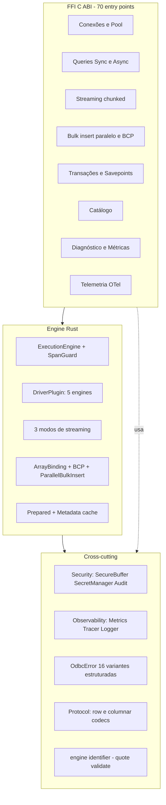

# Superfície de API exposta — `odbc_engine` v2.0.0

Documento que cataloga **tudo** o que o crate Rust expõe, em três camadas:

1. **FFI C ABI** (`extern "C"`) — consumida pelo Dart e por qualquer cliente C.
2. **API Rust pública** — quando `odbc_engine` é usado como `rlib`.
3. **Telemetria OpenTelemetry** — funções FFI separadas para integração OTel.

---

## 1. FFI — Superfície C ABI

**70 funções `extern "C"`** organizadas por capacidade. Convenção geral:
- `c_uint` retornado > 0 = ID de handle (conn, txn, stream, pool, request, statement)
- `c_uint` retornado = 0 = falha (ler `odbc_get_error*` para detalhes)
- `c_int` retornado = 0 = sucesso, negativo = erro categorizado

### 1.1 Bootstrap & introspecção (4)

| Função | Propósito |
|---|---|
| `odbc_init() -> c_int` | Inicializa runtime async + ambiente ODBC singleton. Idempotente. |
| `odbc_set_log_level(level: c_int) -> c_int` | Define nível global do `log` (0=off … 5=trace). |
| `odbc_get_version(buf, buf_len) -> c_int` | Retorna `{api_version, abi_version, protocol_version, crate}` em JSON. |
| `odbc_validate_connection_string(conn_str, ...) -> c_int` | Valida sintaxe da connection string sem conectar. |

### 1.2 Conexões diretas (3)

| Função | Propósito |
|---|---|
| `odbc_connect(conn_str) -> conn_id` | Abre conexão. |
| `odbc_connect_with_timeout(conn_str, timeout_ms) -> conn_id` | Idem com login timeout. |
| `odbc_disconnect(conn_id) -> c_int` | Fecha conexão e libera handles dependentes. |

### 1.3 Pool de conexões r2d2 (8)

| Função | Propósito |
|---|---|
| `odbc_pool_create(conn_str, max_size) -> pool_id` | Cria pool com `PoolAutocommitCustomizer`. |
| `odbc_pool_get_connection(pool_id) -> conn_id` | Checkout sem segurar mutex global (C3 fix). |
| `odbc_pool_release_connection(conn_id) -> c_int` | Devolve ao pool com rollback + autocommit. |
| `odbc_pool_health_check(pool_id) -> c_int` | 1=saudável, 0=falha. |
| `odbc_pool_get_state(pool_id, ...)` | Métricas binárias do pool (size, idle, wait). |
| `odbc_pool_get_state_json(pool_id, ...)` | Mesmo conteúdo em JSON estruturado. |
| `odbc_pool_set_size(pool_id, new_max) -> c_int` | Resize dinâmico. |
| `odbc_pool_close(pool_id) -> c_int` | Drena checkouts antes de remover (C4 fix). |

### 1.4 Transações & savepoints (6)

| Função | Propósito |
|---|---|
| `odbc_transaction_begin(conn_id, isolation, dialect) -> txn_id` | Inicia transação com isolamento + dialeto (Sql92/SqlServer). |
| `odbc_transaction_commit(txn_id) -> c_int` | Commit. |
| `odbc_transaction_rollback(txn_id) -> c_int` | Rollback. |
| `odbc_savepoint_create(txn_id, name) -> c_int` | **A1 fix**: nome validado/quotado. |
| `odbc_savepoint_rollback(txn_id, name) -> c_int` | Idem. |
| `odbc_savepoint_release(txn_id, name) -> c_int` | Sql92 `RELEASE`; no-op em SQL Server. |

### 1.5 Diagnóstico de erro (5)

| Função | Propósito |
|---|---|
| `odbc_get_error(buf, buf_len) -> c_int` | Mensagem simples (legacy). |
| `odbc_get_structured_error(buf, ...) -> c_int` | `{sqlstate[5], native_code, message}` binário. |
| `odbc_get_structured_error_for_connection(conn_id, ...)` | Filtra por conn_id (sem race). |
| `odbc_audit_enable(enabled) -> c_int` | Liga/desliga auditoria. |
| `odbc_audit_get_status(buf, ...) -> c_int` | JSON com contadores e estado. |

### 1.6 Auditoria (3)

| Função | Propósito |
|---|---|
| `odbc_audit_enable(enabled)` | Ativa coleta. |
| `odbc_audit_get_events(buf, ...)` | Despeja eventos como JSON. |
| `odbc_audit_clear()` | Limpa buffer in-memory. |

### 1.7 Métricas (4)

| Função | Propósito |
|---|---|
| `odbc_get_metrics(buf, ...) -> c_int` | Snapshot JSON: `{query_count, error_count, latency_p50/p95/p99, ...}`. |
| `odbc_get_cache_metrics(buf, ...) -> c_int` | Hits/misses do prepared cache + statement cache. |
| `odbc_metadata_cache_stats(buf, ...) -> c_int` | Estatísticas do cache de schemas. |
| `odbc_metadata_cache_clear() -> c_int` | Invalida cache de schemas. |

### 1.8 Caches (3)

| Função | Propósito |
|---|---|
| `odbc_metadata_cache_enable(max_size, ttl_secs) -> c_int` | Liga cache LRU+TTL de metadata. |
| `odbc_metadata_cache_clear()` | Limpa. |
| `odbc_clear_statement_cache() -> c_int` | Limpa cache de prepared statements. |

### 1.9 Detecção de driver (3)

| Função | Propósito |
|---|---|
| `odbc_detect_driver(conn_str, buf, ...) -> c_int` | Heurístico via connection string. Identifica `sqlserver`/`postgres`/`mysql`/`oracle`/`sybase`. |
| `odbc_get_driver_capabilities(conn_str, buf, ...) -> c_int` | Heurístico via connection string. JSON com `{engine, driver_name, prepared, batch, streaming, max_array_size, ...}`. |
| `odbc_get_connection_dbms_info(conn_id, buf, ...) -> c_int` | **NOVO em v2.1**: detecção REAL via `SQLGetInfo` em conexão aberta. JSON com `{dbms_name, engine, max_*_name_len, current_catalog, capabilities}`. Resolve DSN-only, distingue MariaDB de MySQL e ASE de ASA. |

### 1.10 Execução de queries (3)

| Função | Propósito |
|---|---|
| `odbc_exec_query(conn_id, sql, buf, ...) -> c_int` | Sync, sem parâmetros. |
| `odbc_exec_query_params(conn_id, sql, params, ...) -> c_int` | Sync, com `ParamValue` serializado. |
| `odbc_exec_query_multi(conn_id, sql, buf, ...) -> c_int` | Multi-resultset (batch `;`). **A13 fix**: SQLSTATE estruturado. |

### 1.11 Execução assíncrona (4)

| Função | Propósito |
|---|---|
| `odbc_execute_async(conn_id, sql) -> request_id` | Submete para Tokio runtime. |
| `odbc_async_poll(request_id, &out_status) -> c_int` | Pendente/Pronto/Erro. |
| `odbc_async_get_result(request_id, buf, ...) -> c_int` | Recupera buffer quando pronto. |
| `odbc_async_cancel(request_id) -> c_int` | `JoinHandle::abort()` cooperativo. |
| `odbc_async_free(request_id) -> c_int` | Libera slot do `AsyncRequestManager`. |

### 1.12 Statements preparados (4)

| Função | Propósito |
|---|---|
| `odbc_prepare(conn_id, sql, timeout_ms) -> stmt_id` | Prepara e cacheia. |
| `odbc_execute(stmt_id, params, buf, ...) -> c_int` | Executa com bind. |
| `odbc_cancel(stmt_id) -> c_int` | `SQLCancel`; gera erro estruturado se driver não suporta. |
| `odbc_close_statement(stmt_id) -> c_int` | Fecha e remove do cache. |
| `odbc_clear_all_statements() -> c_int` | Limpa todos os statements (shutdown helper). |

### 1.13 Streaming de resultados (7)

| Função | Propósito |
|---|---|
| `odbc_stream_start(conn_id, sql, fetch_size, ...) -> stream_id` | Cursor síncrono. |
| `odbc_stream_start_batched(conn_id, sql, fetch_size, chunk_size, ...) -> stream_id` | Worker thread + `mpsc`. |
| `odbc_stream_start_async(conn_id, sql, ...) -> stream_id` | Worker + status async. |
| `odbc_stream_poll_async(stream_id, &out_status) -> c_int` | Pending/Ready/Done/Cancelled/Error. |
| `odbc_stream_fetch(stream_id, buf, buf_len, &out_written, &has_more) -> c_int` | **C1 fix**: `expect` substituído. **A6 fix**: `read_exact` em spill. |
| `odbc_stream_cancel(stream_id) -> c_int` | Cancelamento cooperativo. |
| `odbc_stream_close(stream_id) -> c_int` | Libera worker e arquivos spill (M4 Drop). |

### 1.14 Catálogo (5)

| Função | Propósito |
|---|---|
| `odbc_catalog_tables(conn_id, ...) -> c_int` | `SQLTables`. |
| `odbc_catalog_columns(conn_id, table, ...) -> c_int` | `SQLColumns`. |
| `odbc_catalog_type_info(conn_id, ...) -> c_int` | `SQLGetTypeInfo`. |
| `odbc_catalog_primary_keys(conn_id, ...) -> c_int` | `SQLPrimaryKeys`. |
| `odbc_catalog_foreign_keys(conn_id, ...) -> c_int` | `SQLForeignKeys`. |
| `odbc_catalog_indexes(conn_id, ...) -> c_int` | `SQLStatistics`. |

### 1.15 Bulk insert (2)

| Função | Propósito |
|---|---|
| `odbc_bulk_insert_array(conn_id, table, payload, ...) -> c_int` | Array binding (`SQL_ATTR_PARAMSET_SIZE`). **A2 fix**: identificadores quotados. **C9 fix**: bitmap validado. |
| `odbc_bulk_insert_parallel(pool_id, payload, parallelism, ...) -> c_int` | rayon + N conexões. **C8 fix**: `BulkPartialFailure` estruturado. |

### 1.16 Telemetria OpenTelemetry (5)

| Função | Propósito |
|---|---|
| `otel_init(endpoint, attrs, ...) -> c_int` | Inicializa exporter (OTLP HTTP ou Console). |
| `otel_export_trace(trace_json, len) -> c_int` | Envia spans em JSON. |
| `otel_export_trace_to_string(buf, len) -> c_int` | Snapshot string para teste. |
| `otel_get_last_error(buf, len) -> c_int` | Último erro do exporter. |
| `otel_cleanup_strings()` | No-op para compatibilidade ABI. |
| `otel_shutdown()` | Flush + drop do exporter. |

---

## 2. API Rust pública (rlib)

Reexportada por `lib.rs`:

```rust
pub use engine::{
    execute_multi_result, execute_query_with_connection, execute_query_with_params,
    OdbcConnection, OdbcEnvironment,
};
pub use error::{OdbcError, Result, StructuredError};
pub use protocol::{
    decode_multi, deserialize_params, encode_multi, serialize_params,
    BinaryProtocolDecoder, ColumnInfo, DecodedResult, MultiResultItem, ParamValue,
};
```

### 2.1 `engine::` — núcleo de execução

| Item | Tipo | Descrição |
|---|---|---|
| `OdbcEnvironment` | struct | Ambiente ODBC singleton (Box::leak). |
| `OdbcConnection` | struct | Wrapper de `Connection<'static>` com lifecycle gerenciado. |
| `Transaction`, `IsolationLevel`, `SavepointDialect`, `TransactionState` | structs/enums | Transações com isolamento + dialeto. |
| `Savepoint` | struct | Savepoint nominal validado via `quote_identifier`. |
| `StatementHandle` | struct | Wrapper de prepared statement com TTL. |
| `StreamingExecutor`, `StreamState`, `BatchedStreamingState`, `AsyncStreamingState`, `StreamingState`, `AsyncStreamStatus` | streaming | Três modos: sync buffer, batched (mpsc), async batched (Tokio). |
| `list_tables`, `list_columns`, `list_primary_keys`, `list_foreign_keys`, `list_indexes`, `get_type_info` | fn | Catálogo high-level. |
| `execute_multi_result`, `execute_query_with_connection`, `execute_query_with_params`, `execute_query_with_params_and_timeout`, `execute_query_with_cached_connection`, `get_global_metrics` | fn | Helpers de query. |

### 2.2 `engine::core::` — engines e adapters internos

| Item | Descrição |
|---|---|
| `ExecutionEngine` | Engine de query com `SpanGuard` (A3 fix), prepared cache, plugin dispatch. |
| `ConnectionManager` | Gerencia ciclo de vida de `CachedConnection`. |
| `BatchExecutor`, `BatchParam`, `BatchQuery` | Execução em lote. |
| `ArrayBinding` | Bulk INSERT via `SQL_ATTR_PARAMSET_SIZE` com identifiers quotados. |
| `BulkCopyExecutor`, `BulkCopyFormat` | SQL Server BCP wrapper (feature `sqlserver-bcp`). |
| `ParallelBulkInsert` (`ParallelMode::{Independent, PerChunkTransactional}`) | rayon + chunked insert. |
| `QueryPipeline`, `QueryPlan` | DAG simples para encadear operações. |
| `MemoryEngine` | Buffer pool com quota global. |
| `MetadataCache`, `TableSchema`, `ColumnMetadata` | LRU+TTL de schemas. |
| `PreparedStatementCache`, `PreparedStatementMetrics` | Cache de SQL strings (rename pendente em v2.1). |
| `DiskSpillStream`, `DiskSpillWriter`, `SpillReadSource` | Spill em disco com Drop seguro (M4 fix). |
| `DriverCapabilities` | Capacidades por engine (sqlserver/postgres/mysql/sqlite). |
| `ProtocolEngine`, `ProtocolVersion` | Selector de protocolo wire. |
| `SecurityLayer`, `SecureBuffer` | Camada de segurança. |

### 2.3 `engine::identifier::` — **NOVO em v2.0.0**

| Item | Descrição |
|---|---|
| `validate_identifier(name) -> Result<()>` | Whitelist `[A-Za-z_][A-Za-z0-9_]{0,127}`. |
| `quote_identifier(name, style)` | Quoting per-DB (`""`, `[]`, `` ` ``). |
| `quote_identifier_default(name)` | Atalho SQL-92 com `""`. |
| `quote_qualified_default(qualified)` | `schema.table` → `"schema"."table"`. |
| `IdentifierQuoting::{DoubleQuote, Brackets, Backtick}` | Estilo de quoting. |
| `MAX_IDENTIFIER_LEN = 128` | Limite conservador. |

### 2.4 `error::` — sistema de erros estruturados

```rust
pub enum OdbcError {
    OdbcApi(String),
    InvalidHandle(u32),
    EmptyConnectionString,
    EnvironmentNotInitialized,
    Structured { sqlstate: [u8; 5], native_code: i32, message: String },
    PoolError(String),
    InternalError(String),
    ValidationError(String),
    UnsupportedFeature(String),
    // NEW v2.0.0
    NoMoreResults,
    MalformedPayload(String),
    RollbackFailed(String),
    ResourceLimitReached(String),
    Cancelled,
    WorkerCrashed(String),
    BulkPartialFailure { rows_inserted_before_failure, failed_chunks, detail },
}

pub enum ErrorCategory { Transient, Fatal, Validation, ConnectionLost }
```

Métodos: `sqlstate()`, `native_code()`, `message()`, `is_retryable()`,
`is_connection_error()`, `error_category()`, `to_structured()`.

### 2.5 `protocol::` — codecs binários

| Item | Descrição |
|---|---|
| `RowBuffer`, `ColumnMetadata` | Buffer linha-orientado. |
| `RowBufferV2`, `ColumnBlock`, `ColumnData`, `CompressionType` | Buffer columnar com compressão. |
| `RowBufferEncoder`, `ColumnarEncoder` | Encoders para os dois formatos. |
| `BinaryProtocolDecoder`, `DecodedResult`, `ColumnInfo` | Decoder do formato wire. |
| `compress`, `decompress` | Zstd/Lz4. |
| `Arena` | Bump allocator para hot path. |
| `row_buffer_to_columnar` | Converte row → columnar com bind binário (C10 fix). |
| `MultiResultItem`, `encode_multi`, `decode_multi` | Multi-resultset. |
| `OdbcType` | Enum com mapeamento SQL ↔ Rust. |
| `BulkInsertPayload`, `BulkColumnSpec`, `BulkColumnData`, `BulkColumnType`, `BulkTimestamp` | Payload de bulk insert. |
| `parse_bulk_insert_payload`, `serialize_bulk_insert_payload` | Round-trip com **caps** `MAX_BULK_*` (M2). |
| `null_bitmap_size`, `is_null`, `is_null_strict` | Bitmap helpers. **C9 fix**: validação up-front + variante strict. |
| `ParamValue`, `serialize_params`, `deserialize_params`, `param_values_to_strings`, `has_null_param`, `max_param_string_len`, `param_count_exceeds_limit` | Sistema de parâmetros. |

### 2.6 `pool::` — connection pool

| Item | Descrição |
|---|---|
| `ConnectionPool` | Wrapper r2d2 com `PoolAutocommitCustomizer` (A14 fix). |
| `PoolOptions` | `{idle_timeout, max_lifetime, connection_timeout}` (A9 fix). |
| `PooledConnectionWrapper` | Acessores `get_connection`/`get_connection_mut`. |

### 2.7 `plugins::` — sistema de drivers

| Item | Descrição |
|---|---|
| `DriverPlugin` (trait) | `name`, `get_capabilities`, `map_type`, `optimize_query`, `get_optimization_rules`. |
| `DriverCapabilities` | `{prepared, batch, streaming, array_fetch, max_row_array_size, name, version}`. |
| `OptimizationRule::{UsePreparedStatements, UseBatchOperations, UseArrayFetch{size}, RewriteQuery{pattern, replacement}, EnableStreaming}` | Hints de otimização. |
| `PluginRegistry` | Registro thread-safe; `is_supported()` adicionado em v2.0.0 (A7). |
| Implementações | `SqlServerPlugin`, `OraclePlugin`, `PostgresPlugin`, `MySqlPlugin`, `SybasePlugin`. |

### 2.8 `security::` — secrets & sanitização

| Item | Descrição |
|---|---|
| `Secret`, `SecretManager` | Storage zerável; `with_secret()` adicionado (M12). |
| `SecureBuffer` | Buffer zerável; `with_bytes()` adicionado, `into_vec()` deprecado (C5). |
| `AuditLogger` | Eventos in-memory com truncagem. |
| `sanitize_connection_string` | Reescrito em v2.0.0: respeita `{...}`, 14 chaves secretas (M10). |

### 2.9 `observability::` — métricas, traces, logs

| Item | Descrição |
|---|---|
| `Metrics`, `QueryMetrics`, `PoolMetrics` | Contadores e histograma fixo (1000 amostras). |
| `Tracer`, `QuerySpan` | Spans por query com metadata. |
| `SpanGuard` (**NOVO em v2.0.0**) | RAII para evitar leak em error paths (A3). |
| `StructuredLogger` | Logger com sanitização de SQL. |
| `sanitize_sql_for_log` (**NOVO**) | Mascara literais (A8); opt-out via `ODBC_FAST_LOG_RAW_SQL=1`. |
| `ENV_LOG_RAW_SQL` | Constante `"ODBC_FAST_LOG_RAW_SQL"`. |

### 2.10 `observability::telemetry::` — OpenTelemetry

| Item | Descrição |
|---|---|
| `ConsoleExporter` | Exporter para stdout. |
| `OtlpExporter` | Exporter HTTP OTLP (feature `observability`). |
| `TelemetryExporter` (trait) | Interface comum. |
| `export_trace` | Helper para console. |
| FFI: `otel_init`, `otel_export_trace`, `otel_export_trace_to_string`, `otel_cleanup_strings`, `otel_get_last_error`, `otel_shutdown` | Bindings OpenTelemetry. |

### 2.11 `versioning::` — protocolo & ABI

| Item | Descrição |
|---|---|
| `ApiVersion::current()` | Lê `env!("CARGO_PKG_VERSION")` (M17 fix). |
| `AbiVersion::current()` | ABI estável (1.0). |
| `ProtocolVersion::current()` | Wire format (V2). |
| Métodos | `is_compatible_with`, `is_breaking_change` (M18). |

### 2.12 `ffi::guard::` — **NOVO em v2.0.0**

| Item | Descrição |
|---|---|
| `call_int<F>`, `call_int_assert_unwind_safe<F>` | Wrapper `catch_unwind` retornando `c_int`. |
| `call_id<F, U>`, `call_id_assert_unwind_safe<F, U>` | Para retornos de ID (`u32`/`u64`). |
| `call_ptr<F, T>`, `call_ptr_assert_unwind_safe<F, T>` | Para retornos de pointer; `null_mut` em panic. |
| `call_size<F>` | Para retornos `usize`. |
| `FfiError` (`#[repr(i32)]`) | Códigos negativos: `NullPointer (-1)`, `InvalidHandle (-2)`, `InvalidArgument (-3)`, `Panic (-4)`, `InternalLock (-5)`, `OdbcError (-6)`, `Timeout (-7)`, `ResourceLimit (-8)`, `Cancelled (-9)`, `Generic (-100)`. |
| `ffi_guard_int!`, `ffi_guard_id!`, `ffi_guard_ptr!` (macros) | Açúcar sintático. |

---

## 3. Capacidades por feature flag (`Cargo.toml`)

| Feature | Default | Adiciona |
|---|---|---|
| `observability` | ✓ | `OtlpExporter` (HTTP via `ureq`). |
| `test-helpers` | ✓ | `dotenvy` para carregar `.env` em testes. |
| `sqlserver-bcp` | ✗ | `BulkCopyExecutor` (Windows + DLL `bcp.dll`). |
| `statement-handle-reuse` | ✗ | LRU de `Prepared<'static>` (cuidado: ainda usa `transmute` — limitação rastreada em v2.1). |
| `ffi-tests` | ✗ | Habilita `tests/ffi_compatibility_test.rs` e expõe FFI no `lib`. |

---

## 4. Mapeamento Dart ↔ FFI (resumo)

A library Dart `dart_odbc_fast` consome a ABI C via `dart:ffi`. Os helpers
de mais alto nível em Dart cobrem:

| Capacidade Rust FFI | Helper Dart típico |
|---|---|
| `odbc_connect*` / `odbc_disconnect` | `OdbcConnection` |
| `odbc_pool_*` | `OdbcConnectionPool` |
| `odbc_transaction_*` / `odbc_savepoint_*` | `OdbcTransaction`, `Savepoint` |
| `odbc_exec_query*` / `odbc_exec_query_multi` | `query()`, `queryMulti()` |
| `odbc_execute_async`, `odbc_async_*` | `Future<Result>` |
| `odbc_stream_*` | `Stream<Row>` chunked |
| `odbc_bulk_insert_*` | `bulkInsert()`, `bulkInsertParallel()` |
| `odbc_catalog_*` | `Catalog` API |
| `otel_*` | OpenTelemetry export bridge |

---

## 5. Capacidades agrupadas (visão executiva)



---

## 6. Itens NÃO expostos (intencionalmente internos)

- `engine::core::sqlserver_bcp` — só compilado em Windows + feature `sqlserver-bcp`; sem export FFI direto, usado via `BulkCopyExecutor`.
- `handles::CachedConnection` — interno do pool; não exposto a Dart.
- `async_bridge` — runtime Tokio compartilhado; usado por `odbc_*_async`.
- `ffi::guard::*` (call_*) — APIs internas para implementar futuras `extern "C"`.
- `engine::core::pipeline::QueryPipeline` — DAG ainda em desenvolvimento; sem FFI.
- `engine::core::memory_engine::MemoryEngine` — buffer pool interno.

---

## 7. Estatísticas finais

| Categoria | Quantidade |
|---|---|
| FFI `extern "C"` | **71** |
| Reexports públicos `lib.rs` | 11 |
| Módulos públicos | 9 (`engine`, `error`, `ffi`, `observability`, `plugins`, `pool`, `protocol`, `security`, `versioning`) |
| Plugins de driver implementados | 5 (`sqlserver`, `postgres`, `mysql`, `oracle`, `sybase`) |
| Variantes de `OdbcError` | 16 (9 originais + 7 novos em v2.0.0) |
| Modos de streaming | 3 (sync buffer, batched mpsc, async Tokio) |
| Modos de bulk insert | 4 (`ArrayBinding`, `BulkCopy` BCP, `ParallelBulkInsert::Independent`, `ParallelBulkInsert::PerChunkTransactional`) |
| Códigos `FfiError` | 10 |
| Feature flags | 5 |

---

Este documento espelha o estado de v2.0.0 (commit atual). Para cada
funcionalidade marcada como "fix" há um teste de regressão correspondente
em [`native/odbc_engine/tests/regression/`](../native/odbc_engine/tests/regression).
