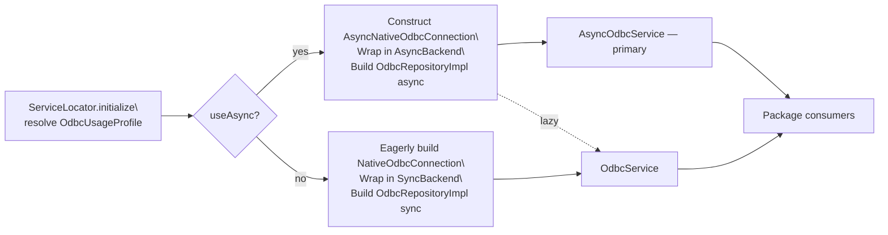
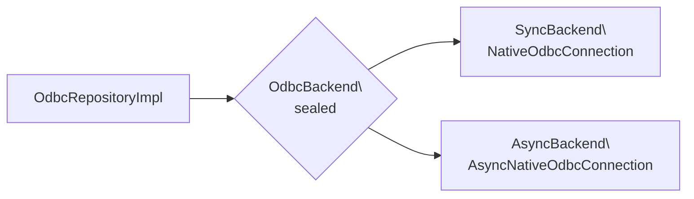
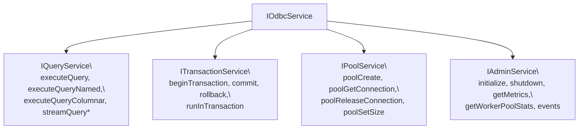
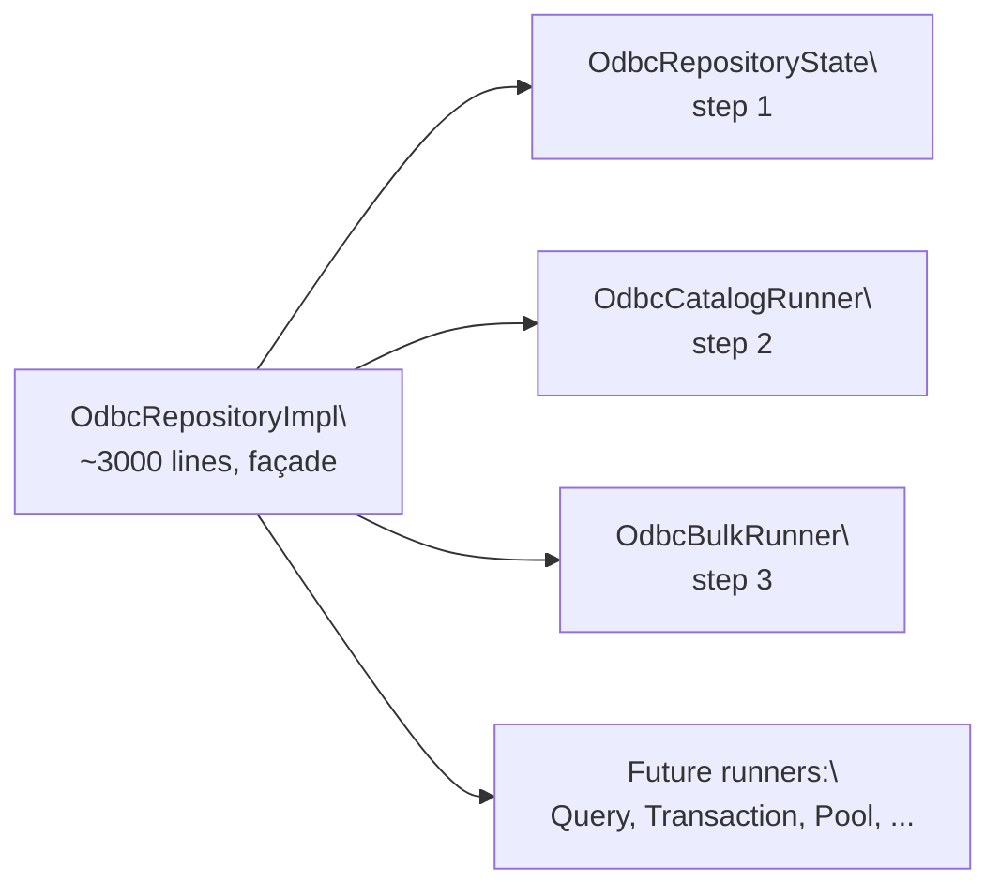
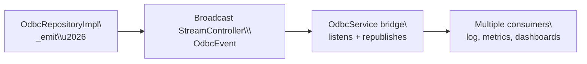

# `dart_odbc_fast` — Dart Layer Architecture

Companion to [`native/odbc_engine/ARCHITECTURE.md`](../native/odbc_engine/ARCHITECTURE.md).
This document describes only the **Dart side** of the package: layers,
boundaries, the public barrel, the service locator, and the runtime
seams (sealed `OdbcBackend`, sub-interfaces of `IOdbcService`, runners
inside the repository, event bus). It does not cover the Rust engine,
the wire protocol, or driver behavior — those live in the native doc.

## High-level layering

```mermaid
flowchart TB
  subgraph Public["Public API barrel — lib/odbc_fast.dart"]
    P[Curated re-exports of domain entities + IOdbcService\nplus opt-in helpers (TypedColumnarResult, OdbcEvent)]
  end

  subgraph Application["application/"]
    A1[IOdbcService — aggregate]
    A2[IQueryService\nITransactionService\nIPoolService\nIAdminService]
    A3[OdbcService — concrete]
    A4[TelemetryOdbcServiceDecorator]
  end

  subgraph Domain["domain/"]
    D1[Connection, ConnectionOptions, QueryResult,\nOdbcMetrics, OdbcEvent, TypedColumnarResult]
    D2[OdbcError sealed hierarchy]
    D3[IOdbcRepository — abstraction]
  end

  subgraph Infrastructure["infrastructure/"]
    I1[OdbcRepositoryImpl — facade]
    I1a[OdbcCatalogRunner\nOdbcBulkRunner\nOdbcRepositoryState]
    I2[Sealed OdbcBackend\nSyncBackend / AsyncBackend]
    I3[NativeOdbcConnection\nAsyncNativeOdbcConnection]
    I4[BinaryProtocolParser\nFrameAccumulator\nLazyString]
  end

  subgraph Core["core/"]
    C1[ServiceLocator]
    C2[AppLogger]
  end

  Public --> Application
  Application --> Domain
  Application --> Infrastructure
  Infrastructure --> Domain
  Application --> Core
  Core --> Infrastructure
  I1 --> I1a
  I1 --> I2
  I2 --> I3
  I3 --> I4
```

The arrows describe **import direction**. Inner layers (`domain`) never
depend on outer layers (`infrastructure`, `application`). The
`OdbcRepositoryImpl` façade is allowed to compose its own runners
(`OdbcCatalogRunner`, `OdbcBulkRunner`) because the runners live in the
same layer.

## Public API barrel

`lib/odbc_fast.dart` is the only entry point package consumers should
import. It re-exports:

- **Domain entities** — `Connection`, `ConnectionOptions`, `QueryResult`
  (with optional `columnsMetadata`), `OdbcMetrics`, `PoolState`,
  `OdbcEvent` (sealed lifecycle events), `TypedColumnarResult`,
  `DartSideMetrics`.
- **Errors** — `OdbcError` sealed hierarchy.
- **Service contracts** — `IOdbcService` aggregate plus the four
  narrower sub-interfaces (`IQueryService`, `ITransactionService`,
  `IPoolService`, `IAdminService`).
- **Concrete service + DI** — `OdbcService`, `ServiceLocator`, opt-in
  `TelemetryOdbcServiceDecorator`.
- **Opt-in helpers** — `LazyString`, `toTypedColumnar`, the `For`
  extensions for `Connection`-based call sites.

Anything **not** exported here is internal — including the runners
inside `infrastructure/repositories/runners/`, the parser internals in
`infrastructure/native/protocol/`, and the `OdbcRepositoryImpl`
itself. Consumers depend on `IOdbcService` (or one of the narrower
sub-interfaces) and let DI choose the implementation.

## Service locator wiring (sync vs async stack)



In legacy / sync mode the service locator builds the sync stack
eagerly. In async mode it defers sync construction until a consumer
explicitly asks for `service`, `syncService`, `nativeConnection`, or
`auditLogger` — avoiding a redundant ODBC environment init when the
async stack is the primary surface.

## Sealed `OdbcBackend`



The repository never holds a `dynamic _native` — it owns a typed
[`OdbcBackend`](../lib/infrastructure/native/odbc_backend.dart) and
dispatches every call through exhaustive pattern matching:

```dart
switch (backend) {
  SyncBackend(:final connection) => connection.executeQuery(...),
  AsyncBackend(:final connection) => await connection.executeQuery(...),
}
```

This eliminates runtime casts, enables the analyzer to enforce that
new backends require explicit handling, and lets the runners (catalog,
bulk) accept a single `OdbcBackend` constructor argument instead of a
sync/async pair.

## Sub-interfaces of `IOdbcService`



Consumers that only need queries should depend on `IQueryService`;
consumers that only manage transactions should depend on
`ITransactionService`; etc. The aggregate `IOdbcService` keeps the
combined surface for backwards compatibility and for code that
genuinely needs multiple categories.

The opt-in `For` extension methods (`executeQueryFor(Connection conn,
...)`) live next to each sub-interface and let call sites take a
`Connection` instead of plumbing `connectionId` strings.

## Repository runners (split in progress)



The repository is being split into composition-first runners
gradually. Each runner is **stateless**: it receives the
`OdbcBackend`, a `nativeIdLookup` closure, and helpers
(`parseBuffer`, `convertError`) via constructor injection so the
façade keeps a single source of truth for cross-cutting concerns.

Runners shipped today:

- [`OdbcCatalogRunner`](../lib/infrastructure/repositories/runners/odbc_catalog_runner.dart)
  — `catalogTables`, `catalogColumns`, `catalogTypeInfo`,
  `catalogPrimaryKeys`, `catalogForeignKeys`, `catalogIndexes`.
- [`OdbcBulkRunner`](../lib/infrastructure/repositories/runners/odbc_bulk_runner.dart)
  — `bulkInsert`, `bulkInsertParallel` (with single-connection
  fallback when `parallelism <= 1`).

The remaining runners (Query, Transaction, Pool) will follow the same
pattern as features evolve. See `native/doc/repository_split_plan.md`
for the long-term plan.

## Event bus pipeline



`IAdminService.events` is a broadcast `Stream<OdbcEvent>`. The
repository emits events at five points (today):

- `ConnectionLost` — `_withReconnect` detected a dropped connection.
- `AutoReconnectAttempted` — `_withReconnect` retried.
- `WorkerRecovered` — async worker pool recovered from a crash.
- `PoolResize` — `poolSetSize` changed pool capacity.
- `SlowQueryDetected` — query crossed the slow-query threshold
  (future emission point; sealed surface ready today).

Listeners do not back-pressure emission — they're observability
signals. The surface is sealed so adding a new event variant is a
deliberate, additive change.

## Related documents

- [`native/odbc_engine/ARCHITECTURE.md`](../native/odbc_engine/ARCHITECTURE.md)
  — Rust engine (workers, FFI, protocol, drivers).
- [`native/doc/ffi_api.md`](../native/doc/ffi_api.md) — exported FFI
  surface.
- [`native/doc/async_api_guide.md`](../native/doc/async_api_guide.md) —
  worker pool + recovery flow.
- [`native/doc/profile_selection_guide.md`](../native/doc/profile_selection_guide.md)
  — `OdbcUsageProfile` decision tree.
- [`CHANGELOG.md`](../CHANGELOG.md) — release notes per PR.
