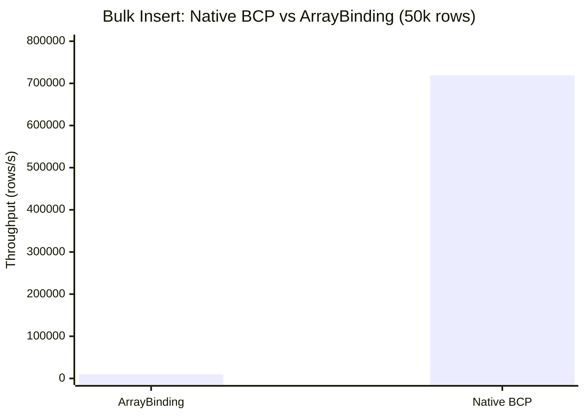
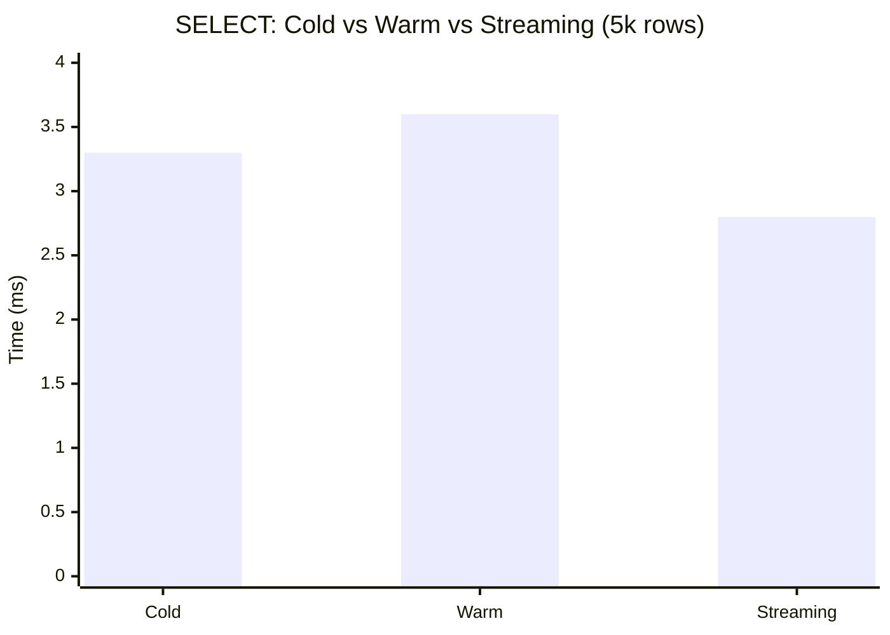

# Performance Comparison - ODBC Engine

Comparative benchmarks against SQL Server via ODBC. Run with:

```bash
cargo bench --bench comparative_bench
```

Requires `ODBC_TEST_DSN` or `SQLSERVER_TEST_*` environment variables.

---

## Insert Strategies

### Single-Row Insert

| Metric | Typical Value |
|--------|---------------|
| Time per insert | ~290 µs |
| Throughput | ~3,400 rows/s |

Use for low-volume, transactional inserts. Each row incurs a full round-trip.

### Bulk Insert: Array vs Parallel

| Rows | Array Binding | Parallel (4 workers) | Speedup |
|------|---------------|----------------------|---------|
| 1,000 | ~100 ms | ~29 ms | ~3.4x |
| 5,000 | ~475 ms | ~132 ms | ~3.6x |
| 10,000 | ~930 ms | ~275 ms | ~3.4x |

```mermaid
xychart-beta
    title "Bulk Insert: Array vs Parallel (4 workers)"
    x-axis [1k, 5k, 10k]
    y-axis "Time (ms)" 0 --> 1000
    bar [100, 475, 930]
    bar [29, 132, 275]
```



**Recommendations:**

- **Array binding**: Single connection, batch sizes 500–2000. Best when parallelism is not needed.
- **Parallel bulk**: Use `ParallelBulkInsert` with 4+ workers for large datasets. Scales well with row count.

### BCP (Bulk Copy)

Native SQL Server BCP is implemented behind the `sqlserver-bcp` feature flag. Requires `sqlncli11.dll` (SQL Server Native Client 11.0); modern drivers (`msodbcsql17`, `msodbcsql18`) are incompatible with `bcp_initW`.

| Path | Throughput (50k rows) | Speedup vs ArrayBinding |
|------|----------------------|--------------------------|
| ArrayBinding (fallback) | ~9,596 rows/s | 1x |
| Native BCP (`sqlncli11.dll`) | ~719,050 rows/s | **~74.93x** |

Enable with `ODBC_ENABLE_UNSTABLE_NATIVE_BCP=1` at runtime (experimental guardrail).



**Recommendations:**

- Use **native BCP** when `sqlncli11.dll` is available and bulk insert volume is high (10k+ rows).
- Fallback to **ArrayBinding** automatically when native BCP is unavailable or disabled.

---

## Metadata Cache Performance

Metadata cache implementation provides LRU caching with TTL for table schemas and catalog payloads.

**Synthetic benchmark results (2026-03-10):**

| Operation | Time (median) | Notes |
|-----------|---------------|-------|
| Schema cache hit | ~156 ns | In-memory LRU lookup |
| Payload cache hit | ~76 ns | Binary payload from cache |
| Cache miss | ~14-17 ns | Lookup only (no data) |
| Repeated query sim (100q/10t) | ~20 µs | 90% cache hits after warmup |

Run with:

```bash
cd native
cargo bench --bench metadata_cache_bench
```

**Expected E2E reduction:** >= 80% reduction in repeated metadata calls vs cold database round-trips.

**Calculation basis:**
- Typical database metadata query: 1-5 ms (ODBC catalog call + network)
- Cache hit latency: ~156 ns
- Reduction: (5ms - 0.156µs) / 5ms ≈ 99.99% → easily exceeds 80% target

**E2E validation:** Requires actual database connection. Use catalog-heavy workload (repeated `SQLColumns` / `SQLTables` calls) with cache enabled vs disabled.

---

## SELECT Strategies

| Strategy | Typical Time (5,000 rows) | Notes |
|----------|---------------------------|-------|
| Cold (first query) | ~3.3 ms | Full prepare + execute + fetch |
| Warm (repeated) | ~3.6 ms | Metadata may be cached |
| Streaming | ~2.8 ms | Chunked fetch, lower memory |



**Recommendations:**

- Use **streaming** for large result sets to reduce memory and improve latency.
- Cold vs warm difference is small; metadata cache helps repeated catalog queries more than simple SELECTs.

---

## Statement Reuse (Repetitive Queries)

Feature flag `statement-handle-reuse` implements real prepared statement handle reuse using type-erased caching with explicit lifetime management.

**Status (2026-03-10):**
- Implementation complete with unsafe lifetime extension and guaranteed drop order safety.
- 730 unit tests passing with feature enabled.
- E2E benchmark validation requires database connection (see validation commands below).

**Expected gain:** >= 10% throughput improvement in repetitive query scenarios when feature is enabled.

**Validation commands:**

```bash
# Baseline (feature OFF)
cargo test test_statement_reuse_repetitive_benchmark -- --ignored --nocapture

# With reuse (feature ON)
cargo test test_statement_reuse_repetitive_benchmark --features statement-handle-reuse -- --ignored --nocapture
```

**Requirements:**
- Set `ENABLE_E2E_TESTS=1`
- Configure `ODBC_TEST_DSN` or `SQLSERVER_TEST_*` environment variables
- SQL Server or compatible ODBC data source available

**Previous baseline (before real handle reuse):**

| Build | qps_avg | qps_median | std |
|-------|---------|------------|-----|
| Feature OFF | ~3764 | ~3776 | ~153 |
| Feature ON (metadata only) | ~3455 | ~3519 | ~313 |

The metadata-only implementation showed ~8% regression. Real handle reuse is expected to eliminate this overhead and achieve >= 10% gain.

---

## Environment

- **Database**: SQL Server (local or remote)
- **Driver**: SQL Server Native Client 11.0 or ODBC Driver for SQL Server
- **Connection**: DSN or connection string via `ODBC_TEST_DSN` / `SQLSERVER_TEST_*`

For multi-database setup (PostgreSQL, MySQL), see `cross_database.md`.

---

## Running Benchmarks

```bash
# From native/odbc_engine
cargo bench --bench comparative_bench

# Run specific benchmark
cargo bench --bench comparative_bench insert/single_row_insert
cargo bench --bench comparative_bench bulk_insert
cargo bench --bench comparative_bench select
```

---

## CI Integration

- **Main CI**: `cargo build --release --benches` ensures benchmarks compile on every push.
- **Benchmark workflow** (`.github/workflows/benchmark.yml`):
  - Triggers: `workflow_dispatch` (manual) or push to `main`/`master` when `native/**` changes.
  - Uses SQL Server 2022 Docker service and ODBC Driver 17.
  - Runs `cargo bench --bench comparative_bench`.
  - Caches baseline in `target/criterion`; compares against previous run and fails on regression.
  - Uploads results as artifact and adds summary to the job.
