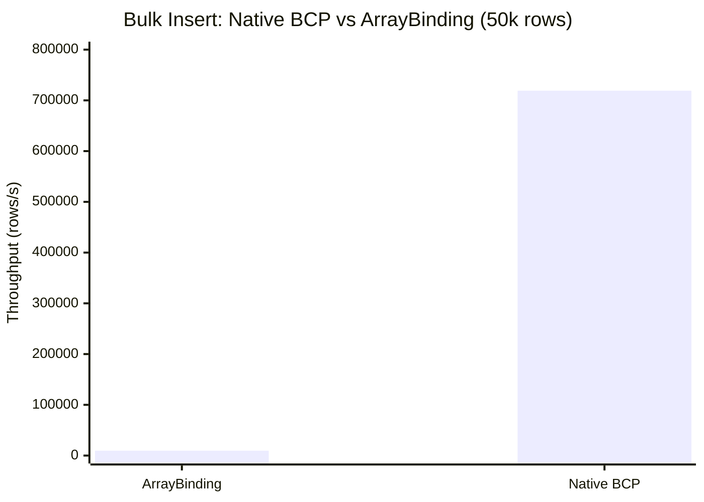
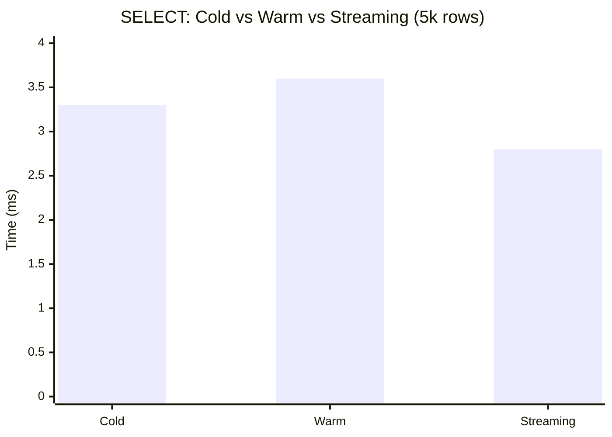

# Performance Comparison - ODBC Engine

Comparative benchmarks against SQL Server via ODBC. Run with:

```bash
cargo bench --bench comparative_bench
```

Requires `ODBC_TEST_DSN` or `SQLSERVER_TEST_*` environment variables.

---

## Insert Strategies

### Single-Row Insert

| Metric | Typical Value |
|--------|---------------|
| Time per insert | ~290 µs |
| Throughput | ~3,400 rows/s |

Use for low-volume, transactional inserts. Each row incurs a full round-trip.

### Bulk Insert: Array vs Parallel

| Rows | Array Binding | Parallel (4 workers) | Speedup |
|------|---------------|----------------------|---------|
| 1,000 | ~100 ms | ~29 ms | ~3.4x |
| 5,000 | ~475 ms | ~132 ms | ~3.6x |
| 10,000 | ~930 ms | ~275 ms | ~3.4x |


```mermaid
xychart-beta
    title "Bulk Insert: Array vs Parallel (4 workers)"
    x-axis [1k, 5k, 10k]
    y-axis "Time (ms)" 0 --> 1000
    bar [100, 475, 930]
    bar [29, 132, 275]
```

**Recommendations:**

- **Array binding**: Single connection, batch sizes 500–2000. Best when parallelism is not needed.
- **Parallel bulk**: Use `ParallelBulkInsert`/`odbc_bulk_insert_parallel`
  with 4+ workers for large datasets. The default ArrayBinding path executes
  worker chunks by row range over the original payload, avoiding a full payload
  clone per worker.
- **Streaming spill**: When `ODBC_STREAM_SPILL_THRESHOLD_MB` is enabled,
  encoded chunks are written without per-chunk temporary allocation and
  file-backed reads keep the spill file open across fetches. FFI stream fetch
  writes directly into the caller buffer, avoiding an intermediate chunk `Vec`
  allocation on every fetch. This reduces CPU and filesystem overhead for large
  result sets without changing the wire format.
- **Protocol encoding**: Row-buffer, bulk payload, and multi-result encoders
  pre-measure payload sizes before writing. This keeps large FFI payloads on a
  single planned allocation path where possible and rejects impossible
  multi-result lengths before emitting truncated length fields.
- **Columnar/parameter paths**: Columnar v2 skips the temporary column payload
  buffer when no compression is emitted, and parameter serialization builds the
  full parameter list in one preallocated buffer.

### BCP (Bulk Copy)

Native SQL Server BCP is implemented behind the `sqlserver-bcp` feature flag. Requires `sqlncli11.dll` (SQL Server Native Client 11.0); modern drivers (`msodbcsql17`, `msodbcsql18`) are incompatible with `bcp_initW`.

| Path | Throughput (50k rows) | Speedup vs ArrayBinding |
|------|----------------------|--------------------------|
| ArrayBinding (fallback) | ~9,596 rows/s | 1x |
| Native BCP (`sqlncli11.dll`) | ~719,050 rows/s | **~74.93x** |

Enable with `ODBC_ENABLE_UNSTABLE_NATIVE_BCP=1` at runtime (experimental guardrail).


```mermaid
xychart-beta
    title "Bulk Insert: Native BCP vs ArrayBinding (50k rows)"
    x-axis ["ArrayBinding", "Native BCP"]
    y-axis "Throughput (rows/s)" 0 --> 800000
    bar [9596, 719050]
```

**Recommendations:**

- Use **native BCP** when `sqlncli11.dll` is available and bulk insert volume is high (10k+ rows).
- Fallback to **ArrayBinding** automatically when native BCP is unavailable or disabled.
- In parallel mode with `sqlserver-bcp`, BCP still materializes an owned payload
  per chunk because the BCP executor consumes `BulkInsertPayload`; this is the
  documented fallback when range/view execution is unavailable.

---

## Metadata Cache Performance

Metadata cache implementation provides LRU caching with TTL for table schemas and catalog payloads.

**Synthetic benchmark results (2026-03-10):**

| Operation | Time (median) | Notes |
|-----------|---------------|-------|
| Schema cache hit | ~156 ns | In-memory LRU lookup |
| Payload cache hit | ~76 ns | Binary payload from cache |
| Cache miss | ~14-17 ns | Lookup only (no data) |
| Repeated query sim (100q/10t) | ~20 µs | 90% cache hits after warmup |

Run with:

```bash
cd native
cargo bench --bench metadata_cache_bench
```

**Expected E2E reduction:** >= 80% reduction in repeated metadata calls vs cold database round-trips.

**Calculation basis:**
- Typical database metadata query: 1-5 ms (ODBC catalog call + network)
- Cache hit latency: ~156 ns
- Reduction: (5ms - 0.156µs) / 5ms ≈ 99.99% → easily exceeds 80% target

**E2E validation:** Requires actual database connection. Use catalog-heavy workload (repeated `SQLColumns` / `SQLTables` calls) with cache enabled vs disabled.

---

## SELECT Strategies

| Strategy | Typical Time (5,000 rows) | Notes |
|----------|---------------------------|-------|
| Cold (first query) | ~3.3 ms | Full prepare + execute + fetch |
| Warm (repeated) | ~3.6 ms | Metadata may be cached |
| Streaming | ~2.8 ms | Chunked fetch, lower memory |


```mermaid
xychart-beta
    title "SELECT: Cold vs Warm vs Streaming (5k rows)"
    x-axis ["Cold", "Warm", "Streaming"]
    y-axis "Time (ms)" 0 --> 4
    bar [3.3, 3.6, 2.8]
```

**Recommendations:**

- Use **streaming** for large result sets to reduce memory and improve latency.
  `odbc_stream_start` no longer holds the global FFI state lock while executing
  or encoding; for bounded Rust-side memory prefer batched streaming or set
  `ODBC_STREAM_SPILL_THRESHOLD_MB` for file-backed buffer-mode streaming.
- Cold vs warm difference is small; metadata cache helps repeated catalog queries more than simple SELECTs.

---

## Statement Reuse (Repetitive Queries)

Feature `statement-handle-reuse` is **default ON** since the Unreleased perf
follow-ups. `CachedConnection` keeps a per-connection LRU of
`OwnedPreparedStatement` — an RAII guard that confines the `mem::transmute`
used to fabricate a `'static` lifetime in a single point of `unsafe`
(`handles::owned_prepared::from_borrowed`). Drop order is enforced by field
declaration order in `CachedConnection` (`stmt_cache` declared before `conn`);
a unit test trips if a future `odbc-api` release changes the layout of
`Prepared`. The cache is reused on the parameterised path too via
`CachedConnection::execute_query_with_params` and the FFI helper
`try_cached_legacy_params` (legacy `ParamValue` list without NULLs).

**Expected gain:** >= 10% throughput improvement in repetitive query
scenarios on hot connections; the synthetic
`prepared_cache_bench::parameterized_hit_path` group (
`cache_hit_rebind_only` vs `prepare_every_call`) quantifies the upper bound.

**Validation commands:**

```bash
# Cold prepare every call (opt out of the new default)
cargo test test_statement_reuse_repetitive_benchmark --no-default-features --features test-helpers,observability -- --ignored --nocapture

# Default build (statement-handle-reuse + block-cursor-fetch ON)
cargo test test_statement_reuse_repetitive_benchmark -- --ignored --nocapture
```

**Requirements:**
- Set `ENABLE_E2E_TESTS=1`
- Configure `ODBC_TEST_DSN` or `SQLSERVER_TEST_*` environment variables
- SQL Server or compatible ODBC data source available

**Previous baseline (before real handle reuse):**

| Build | qps_avg | qps_median | std |
|-------|---------|------------|-----|
| Feature OFF | ~3764 | ~3776 | ~153 |
| Feature ON (metadata only) | ~3455 | ~3519 | ~313 |

The metadata-only implementation showed ~8% regression. Real handle reuse
(now the default) eliminates this overhead.

---

## BlockCursor row-major fetch + direct columnar

Feature `block-cursor-fetch` is **default ON** as well. The fetch dispatcher
in `engine::fetch::fetch_cursor_into_row_buffer` chooses between:

- **Block path** (`engine::core::block_fetch::fetch_rows_into`):
  `ColumnarAnyBuffer` bound via `cursor.bind_buffer`, then
  `BlockCursor::fetch_with_truncation_check(true)` in batches of
  `ODBC_FAST_BLOCK_FETCH_BATCH` rows (default `256`). `Date`, `Time`,
  `Timestamp` columns now bind native `BufferDesc::Date / Time / Timestamp`
  buffers and are formatted to ISO 8601 in-process, skipping the
  driver-side WCHAR transcoding.
- **Legacy per-row loop** when `plan_buffer_descs` decides the result is
  not bindable (LOBs, `WLONGVARCHAR` without an advertised max length, or
  per-cell buffers above 256 KiB).

When the encoder asks for columnar output and the result is not FOR JSON,
`engine::core::columnar_fetch::fetch_columnar_into` populates
`RowBufferV2` directly from `ColumnarAnyBuffer` views, eliminating the
row-major intermediate and the per-cell clones that
`row_buffer_to_columnar` paid (`row_buffer_to_columnar` is marked
`#[deprecated]` on the doc-comment; still used by `encode_for_bulk` and
when `block-cursor-fetch` is off).

Synthetic benches that quantify these paths (no DSN required):

```bash
cargo bench --bench cell_reader_bench       # Integer/BigInt/Varchar/Binary/Date/Timestamp
cargo bench --bench encoder_bench           # direct_columnar_vs_via_row_major group
cargo bench --bench prepared_cache_bench    # parameterized_hit_path group
cargo bench --bench ffi_contention_bench    # synthetic N-thread FFI contention model
```

Baselines are tracked in
[`native/odbc_engine/benches/baselines/README.md`](../odbc_engine/benches/baselines/README.md).
The weekly cron in
[`.github/workflows/native_bench_baseline.yml`](../../.github/workflows/native_bench_baseline.yml)
runs all four on a fixed Linux runner and uploads Criterion HTML.

---

## Environment

- **Database**: SQL Server (local or remote)
- **Driver**: SQL Server Native Client 11.0 or ODBC Driver for SQL Server
- **Connection**: DSN or connection string via `ODBC_TEST_DSN` / `SQLSERVER_TEST_*`

For multi-database setup (PostgreSQL, MySQL), see `cross_database.md`.

---

## Running Benchmarks

```bash
# From native/odbc_engine
cargo bench --bench comparative_bench

# Run specific benchmark
cargo bench --bench comparative_bench insert/single_row_insert
cargo bench --bench comparative_bench bulk_insert
cargo bench --bench comparative_bench select
```

---

## CI Integration

- **Main CI**: `cargo build --release --benches` ensures benchmarks compile on every push.
- **Benchmark workflow** (`.github/workflows/benchmark.yml`):
  - Triggers: `workflow_dispatch` (manual) or push to `main`/`master` when `native/**` changes.
  - Uses SQL Server 2022 Docker service and ODBC Driver 17.
  - Runs `cargo bench --bench comparative_bench`.
  - Caches baseline in `target/criterion`; compares against previous run and fails on regression.
  - Uploads results as artifact and adds summary to the job.
