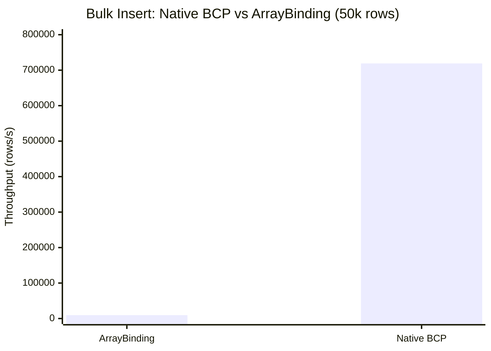
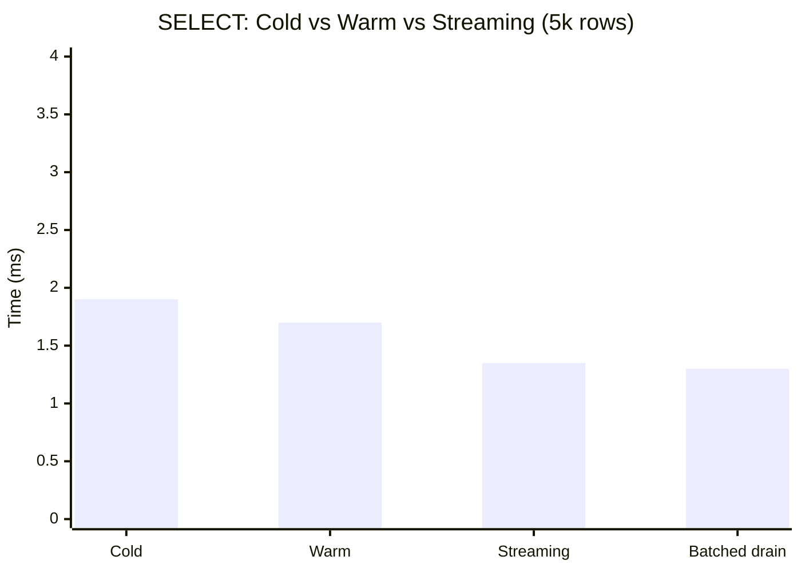

# Performance Comparison - ODBC Engine

## Pool and transaction FFI hot paths (local measurement, 2026-09-24)

Windows x64 (build 26200), Intel Core Ultra 7 155H, Rust 1.93, SQL Server
Native Client 11.0 and the configured SQL Server `ODBC_TEST_DSN`. The baseline
is a source snapshot of the pre-change dirty working tree; the current tree
and baseline use the same `native/Cargo.lock`, release profile, default Cargo
features plus `test-helpers`, benchmark source and DSN. No database objects
were changed. Threads and the eight regular connections were created before
measurement. Each Criterion iteration performs 10 checkout/checkin or
begin/commit operations per active connection; the pool has capacity eight.

```powershell
$env:ODBC_LIVE_BENCH = '1'
$env:ODBC_TEST_DSN = '<SQL Server test DSN or connection string>'
cargo bench --locked --manifest-path native/odbc_engine/Cargo.toml --features test-helpers --bench live_hotpaths_bench -- 'live_ffi/pool_transaction_sustained' --sample-size 10 --warm-up-time 1 --measurement-time 3
```

The table uses one sequential, unloaded baseline/current pair. An earlier
baseline that overlapped release compilation was excluded because contention
roughly doubled some timings. Throughput is calculated from the Criterion
point estimate and the number of operations per iteration, not independently
measured. CPU frequency and database scheduling were not pinned.

| Workload | Connections | Baseline latency / throughput | Current latency / throughput | Observed latency change |
| --- | ---: | ---: | ---: | ---: |
| Checkout/checkin | 1 | 1.7645 ms / 5.7k ops/s | 0.9594 ms / 10.4k ops/s | -45.6% |
| Checkout/checkin | 4 | 2.8884 ms / 13.8k ops/s | 1.3280 ms / 30.1k ops/s | -54.0% |
| Checkout/checkin | 8 | 4.2179 ms / 19.0k ops/s | 2.2202 ms / 36.0k ops/s | -47.4% |
| Begin/commit | 1 | 1.7612 ms / 5.7k ops/s | 1.6926 ms / 5.9k ops/s | -3.9% |
| Begin/commit | 4 | 2.5918 ms / 15.4k ops/s | 2.3708 ms / 16.9k ops/s | -8.5% |
| Begin/commit | 8 | 4.2349 ms / 18.9k ops/s | 4.0997 ms / 19.5k ops/s | -3.2% |

The checkout result is clear in this workload; the short-transaction changes
are small relative to observed run-to-run variation and are **not** claimed
as a stable gain. A separate repeated single-connection prepared-query case
measured 0.495–0.543 ms in the current tree versus 0.685 ms in one baseline
run; that narrower comparison is provisional. Allocations and peak process
memory were not instrumented. Results do not establish performance on other
drivers, server locations or application query mixes.

## Streaming follow-up microbenchmarks (local measurement, 2026-09-24)

Windows x64, Intel Core Ultra 7 155H, Rust 1.93, release profile and default
Cargo features, without a DSN. Criterion compared both variants inside the
same bench binary. The buffer benchmark includes production batch-copy logic,
but not ODBC execution, producer/consumer scheduling or allocator telemetry.
Each entry below is the point estimate from 30 samples, 0.5 s warm-up and
2 s measurement; the three runs were made consecutively:

```powershell
cd native
1..3 | ForEach-Object {
  cargo bench -p odbc_engine --bench buffer_recycle_bench -- 'stream_buffer_copy' --sample-size 30 --warm-up-time 0.5 --measurement-time 2
}
```

| Encoded batch | Fresh / recycled, run 1 | Run 2 | Run 3 | Interpretation |
| --- | ---: | ---: | ---: | --- |
| 64 KiB | 2.346 / 2.402 µs | 2.334 / 2.266 µs | 3.450 / 2.993 µs | No repeated >5% regression; small-batch effect is noisy |
| 1 MiB | 340.29 / 66.34 µs | 345.97 / 64.91 µs | 331.41 / 64.55 µs | About 80–81% less time in this allocation-and-copy workload |

The bounded per-stream recycling pool is retained because the 1 MiB result
was consistent and the 64 KiB case did not show a repeated relevant
regression. This does **not** establish an 80% end-to-end streaming gain.

The fallback transposition comparison uses the production transposition and
encoder, but clones the in-memory row fixture for each batch. With 16 batches
of 1,000 rows, fresh/reused point estimates were 2.074/2.231 ms,
1.511/1.424 ms and 1.442/1.452 ms across three runs. The signs differ, so
the benchmark does not establish a reliable CPU gain; separate regressions
verify byte parity:

```powershell
cd native
1..3 | ForEach-Object {
  cargo bench -p odbc_engine --bench fallback_transpose_bench -- 'fallback_transpose_16_batches' --sample-size 20 --warm-up-time 0.5 --measurement-time 2
}
```

In a separate 20-sample, 0.5 s warm-up, 2 s measurement run,
`stream_param_decode_bench` compared the former full-buffer copy plus decode
against scoped direct decode of the same serialized fixture: legacy 16 MiB
blob 9.426/4.206 ms and DRT1 1 MiB blob 656/328 µs. The 1 KiB legacy case
was 136/132 ns, inside practical measurement noise. These are decoder-only
results; the 1 MiB legacy run had large outliers and should be repeated
before claiming a precise percentage:

```powershell
cd native
cargo bench -p odbc_engine --bench stream_param_decode_bench -- 'stream_param_decode' --sample-size 20 --warm-up-time 0.5 --measurement-time 2
```

## Compressed columnar encoder (local measurement, 2026-09-23)

Criterion exercised the production `ColumnarEncoder::encode` with a mixed
8-column fixture, encoding 16 batches per iteration. These are in-memory
encoder timings, **not** ODBC fetch or end-to-end stream throughput. Both
measurements used the same release profile/default Cargo features, Windows,
Intel Core Ultra 7 155H, 10 samples, 0.2 s warm-up and 0.4 s measurement:

```powershell
cd native/odbc_engine
cargo bench --bench encoder_bench -- 'encoder/streaming_columnar_compressed' --sample-size 10 --warm-up-time 0.2 --measurement-time 0.4
```

| Workload | Before (Criterion point estimate) | After | Change |
| --- | ---: | ---: | ---: |
| 16 × 100 rows × 8 columns | 17.189 ms | 0.486 ms | -97.2% |
| 16 × 1,000 rows × 8 columns | 37.288 ms | 6.919 ms | -81.4% |

The reduced zstd context/setup work and reusable scratch space affect this
fixture strongly. The benchmark creates a fresh workspace for each standalone
`encode` call; per-cursor reuse across batches and live-driver performance
are **not** measured here. The short run and unpinned CPU frequency limit
precision; these figures should not be projected to other drivers or data
distributions.

## Live FFI hot paths (post-change only, 2026-09-23)

The opt-in benchmark calls the production FFI against the configured SQL
Server ODBC DSN. It reads `sys.all_objects` only. Measurements below used the
same Windows / Intel Core Ultra 7 155H host, release profile, default features
plus `test-helpers`, 10 samples, 0.2 s warm-up and 0.4 s measurement:

```powershell
$env:ODBC_LIVE_BENCH = '1'
$env:ODBC_TEST_DSN = '<SQL Server test DSN or connection string>'
cargo bench --manifest-path native/odbc_engine/Cargo.toml --features test-helpers --bench live_hotpaths_bench -- 'live_ffi' --sample-size 10 --warm-up-time 0.2 --measurement-time 0.4
```

| FFI workload per iteration | Mean |
| --- | ---: |
| 1 connection × 10 queries × 100 rows | 5.61 ms |
| 4 connections × 10 queries × 100 rows | 6.90 ms |
| 8 connections × 10 queries × 100 rows | 12.89 ms |
| Stream 100 rows, row-major / compression-enabled columnar | 0.689 / 0.815 ms |
| Stream 1,000 rows, row-major / compression-enabled columnar | 2.42 / 2.74 ms |
| Parameterized numeric NULL / 4 KiB blob with NULL | 0.350 / 1.54 ms |
| Repeated MULT sync / streaming | 0.140 / 0.314 ms |

These are post-change measurements, with **no comparable pre-change live
baseline**, so they do not establish a speedup. The concurrent cases complete
10 queries per connection (10/40/80 total), not the same amount of work; do
not compare their raw latencies as scaling percentages. The columnar mode
enables zstd but may publish raw fallback per column. A separate process
sampler observed a 44 MiB peak working set during the full run (46 samples),
not allocator-level peak usage. Short samples and shared-machine scheduling
made some same-revision cases fluctuate by over 5%; three repeat runs of the
suspect parameter/MULT cases did not show a consistent regression.

---

Comparative benchmarks against SQL Server via ODBC. Run with:

```bash
cargo bench --bench comparative_bench
```

Requires `ODBC_TEST_DSN` or `SQLSERVER_TEST_*` environment variables.
Dart-side typical numbers (CRUD / streaming / smoke) live in the README
**Typical local numbers** subsection.

---

## Insert Strategies

### Single-Row Insert

| Metric | Typical Value |
|--------|---------------|
| Time per insert | ~290 µs |
| Throughput | ~3,400 rows/s |

Use for low-volume, transactional inserts. Each row incurs a full round-trip.

### Bulk Insert: Array vs Parallel

| Rows | Array Binding | Parallel (4 workers) | Speedup |
|------|---------------|----------------------|---------|
| 1,000 | ~80–100 ms | ~30 ms | ~3.4x |
| 5,000 | ~430 ms | ~140 ms | ~3.1x |
| 10,000 | ~830 ms | ~280 ms | ~3.0x |


```mermaid
xychart-beta
    title "Bulk Insert: Array vs Parallel (4 workers)"
    x-axis [1k, 5k, 10k]
    y-axis "Time (ms)" 0 --> 1000
    bar [90, 430, 830]
    bar [30, 140, 280]
```

**Recommendations:**

- **Array binding**: Single connection, batch sizes 500–2000. Best when parallelism is not needed.
- **Parallel bulk**: Use `ParallelBulkInsert`/`odbc_bulk_insert_parallel`
  with 4+ workers for large datasets. The default ArrayBinding path executes
  worker chunks by row range over the original payload, avoiding a full payload
  clone per worker.
- **Streaming spill**: When `ODBC_STREAM_SPILL_THRESHOLD_MB` is enabled,
  encoded chunks are written without per-chunk temporary allocation and
  file-backed reads keep the spill file open across fetches. FFI stream fetch
  writes directly into the caller buffer, avoiding an intermediate chunk `Vec`
  allocation on every fetch. This reduces CPU and filesystem overhead for large
  result sets without changing the wire format.
- **Protocol encoding**: Row-buffer, bulk payload, and multi-result encoders
  pre-measure payload sizes before writing. This keeps large FFI payloads on a
  single planned allocation path where possible and rejects impossible
  multi-result lengths before emitting truncated length fields.
- **Columnar/parameter paths**: Columnar v2 skips the temporary column payload
  buffer when no compression is emitted, and parameter serialization builds the
  full parameter list in one preallocated buffer.

### BCP (Bulk Copy)

Native SQL Server BCP is implemented behind the `sqlserver-bcp` feature flag. Requires `sqlncli11.dll` (SQL Server Native Client 11.0); modern drivers (`msodbcsql17`, `msodbcsql18`) are incompatible with `bcp_initW`.

| Path | Throughput (50k rows) | Speedup vs ArrayBinding |
|------|----------------------|--------------------------|
| ArrayBinding (fallback) | ~9,596 rows/s | 1x |
| Native BCP (`sqlncli11.dll`) | ~719,050 rows/s | **~74.93x** |

Enable with `ODBC_ENABLE_UNSTABLE_NATIVE_BCP=1` at runtime (experimental guardrail).


```mermaid
xychart-beta
    title "Bulk Insert: Native BCP vs ArrayBinding (50k rows)"
    x-axis ["ArrayBinding", "Native BCP"]
    y-axis "Throughput (rows/s)" 0 --> 800000
    bar [9596, 719050]
```

**Recommendations:**

- Use **native BCP** when `sqlncli11.dll` is available and bulk insert volume is high (10k+ rows).
- Fallback to **ArrayBinding** automatically when native BCP is unavailable or disabled.
- In parallel mode with `sqlserver-bcp`, BCP still materializes an owned payload
  per chunk because the BCP executor consumes `BulkInsertPayload`; this is the
  documented fallback when range/view execution is unavailable.

---

## Metadata Cache Performance

Metadata cache implementation provides LRU caching with TTL for table schemas and catalog payloads.

**Synthetic benchmark results (2026-03-10):**

| Operation | Time (median) | Notes |
|-----------|---------------|-------|
| Schema cache hit | ~156 ns | In-memory LRU lookup |
| Payload cache hit | ~76 ns | Binary payload from cache |
| Cache miss | ~14-17 ns | Lookup only (no data) |
| Repeated query sim (100q/10t) | ~20 µs | 90% cache hits after warmup |

Run with:

```bash
cd native
cargo bench --bench metadata_cache_bench
```

**Expected E2E reduction:** >= 80% reduction in repeated metadata calls vs cold database round-trips.

**Calculation basis:**
- Typical database metadata query: 1-5 ms (ODBC catalog call + network)
- Cache hit latency: ~156 ns
- Reduction: (5ms - 0.156µs) / 5ms ≈ 99.99% → easily exceeds 80% target

**E2E validation:** Requires actual database connection. Use catalog-heavy workload (repeated `SQLColumns` / `SQLTables` calls) with cache enabled vs disabled.

---

## SELECT Strategies

| Strategy | Typical Time (5,000 rows) | Notes |
|----------|---------------------------|-------|
| Cold (first query) | ~1.8–2.0 ms | Full prepare + execute + fetch |
| Warm (repeated) | ~1.7 ms | Metadata may be cached |
| Streaming | ~1.3–1.4 ms | Chunked fetch, lower memory |
| Streaming batched drain | ~1.3 ms | Bounded-memory batched path |


```mermaid
xychart-beta
    title "SELECT: Cold vs Warm vs Streaming (5k rows)"
    x-axis ["Cold", "Warm", "Streaming", "Batched drain"]
    y-axis "Time (ms)" 0 --> 4
    bar [1.9, 1.7, 1.35, 1.3]
```

**Recommendations:**

- Use **streaming** for large result sets to reduce memory and improve latency.
  `odbc_stream_start` no longer holds the global FFI state lock while executing
  or encoding; for bounded Rust-side memory prefer batched streaming or set
  `ODBC_STREAM_SPILL_THRESHOLD_MB` for file-backed buffer-mode streaming.
- Cold vs warm difference is small; metadata cache helps repeated catalog queries more than simple SELECTs.

---

## Statement Reuse (Repetitive Queries)

Feature `statement-handle-reuse` is **default ON** since the Unreleased perf
follow-ups. `CachedConnection` keeps a per-connection LRU of
`OwnedPreparedStatement` — an RAII guard that confines the `mem::transmute`
used to fabricate a `'static` lifetime in a single point of `unsafe`
(`handles::owned_prepared::from_borrowed`). Drop order is enforced by field
declaration order in `CachedConnection` (`stmt_cache` declared before `conn`);
a unit test trips if a future `odbc-api` release changes the layout of
`Prepared`. The cache is reused on the parameterised path too via
`CachedConnection::execute_query_with_params` and the FFI helper
`try_cached_legacy_params` (legacy `ParamValue` list without NULLs).

**Expected gain:** >= 10% throughput improvement in repetitive query
scenarios on hot connections; the synthetic
`prepared_cache_bench::parameterized_hit_path` group (
`cache_hit_rebind_only` vs `prepare_every_call`) quantifies the upper bound.

**Validation commands:**

```bash
# Cold prepare every call (opt out of the new default)
cargo test test_statement_reuse_repetitive_benchmark --no-default-features --features test-helpers,observability -- --ignored --nocapture

# Default build (statement-handle-reuse + block-cursor-fetch ON)
cargo test test_statement_reuse_repetitive_benchmark -- --ignored --nocapture
```

**Requirements:**
- Set `ENABLE_E2E_TESTS=1`
- Configure `ODBC_TEST_DSN` or `SQLSERVER_TEST_*` environment variables
- SQL Server or compatible ODBC data source available

**Previous baseline (before real handle reuse):**

| Build | qps_avg | qps_median | std |
|-------|---------|------------|-----|
| Feature OFF | ~3764 | ~3776 | ~153 |
| Feature ON (metadata only) | ~3455 | ~3519 | ~313 |

The metadata-only implementation showed ~8% regression. Real handle reuse
(now the default) eliminates this overhead.

---

## BlockCursor row-major fetch + direct columnar

Feature `block-cursor-fetch` is **default ON** as well. The fetch dispatcher
in `engine::fetch::fetch_cursor_into_row_buffer` chooses between:

- **Block path** (`engine::core::block_fetch::fetch_rows_into`):
  `ColumnarAnyBuffer` bound via `cursor.bind_buffer`, then
  `BlockCursor::fetch_with_truncation_check(true)` in batches of
  `ODBC_FAST_BLOCK_FETCH_BATCH` rows (default `256`). `Date`, `Time`,
  `Timestamp` columns now bind native `BufferDesc::Date / Time / Timestamp`
  buffers and are formatted to ISO 8601 in-process, skipping the
  driver-side WCHAR transcoding.
- **Legacy per-row loop** when `plan_buffer_descs` decides the result is
  not bindable (LOBs, `WLONGVARCHAR` without an advertised max length, or
  per-cell buffers above 256 KiB).

When the encoder asks for columnar output and the result is not FOR JSON,
`engine::core::columnar_fetch::fetch_columnar_into` populates
`RowBufferV2` directly from `ColumnarAnyBuffer` views, eliminating the
row-major intermediate and the extra transposition pass. The fallback
`row_buffer_to_columnar` moves binary/text cells; batched fallback streams
also reuse metadata, typed vectors and compression scratch across batches.

Synthetic benches that quantify these paths (no DSN required):

```bash
cargo bench --bench cell_reader_bench       # Integer/BigInt/Varchar/Binary/Date/Timestamp
cargo bench --bench encoder_bench           # direct_columnar_vs_via_row_major group
cargo bench --bench prepared_cache_bench    # parameterized_hit_path group
cargo bench --bench ffi_contention_bench    # synthetic N-thread FFI contention model
cargo bench --bench fallback_transpose_bench # one-shot vs reused fallback transposition
cargo bench --bench buffer_recycle_bench     # fresh vs reused batch output buffer
cargo bench --bench stream_param_decode_bench # copied vs borrowed parameter payload
```

Baselines are tracked in
[`native/odbc_engine/benches/baselines/README.md`](../odbc_engine/benches/baselines/README.md).
The weekly cron in
[`.github/workflows/native_bench_baseline.yml`](../../.github/workflows/native_bench_baseline.yml)
runs all four on a fixed Linux runner and uploads Criterion HTML.

---

## Environment

- **Database**: SQL Server (local or remote)
- **Driver**: SQL Server Native Client 11.0 or ODBC Driver for SQL Server
- **Connection**: DSN or connection string via `ODBC_TEST_DSN` / `SQLSERVER_TEST_*`

For multi-database setup (PostgreSQL, MySQL), see `cross_database.md`.

---

## Running Benchmarks

```bash
# From native/odbc_engine
cargo bench --bench comparative_bench

# Run specific benchmark
cargo bench --bench comparative_bench insert/single_row_insert
cargo bench --bench comparative_bench bulk_insert
cargo bench --bench comparative_bench select
```

---

## CI Integration

- **Main CI**: `cargo build --release --benches` ensures benchmarks compile on every push.
- **Benchmark workflow** (`.github/workflows/benchmark.yml`):
  - Triggers: `workflow_dispatch` (manual) or push to `main`/`master` when `native/**` changes.
  - Uses SQL Server 2022 Docker service and ODBC Driver 17.
  - Runs `cargo bench --bench comparative_bench`.
  - Caches baseline in `target/criterion`; compares against previous run and fails on regression.
  - Uploads results as artifact and adds summary to the job.
