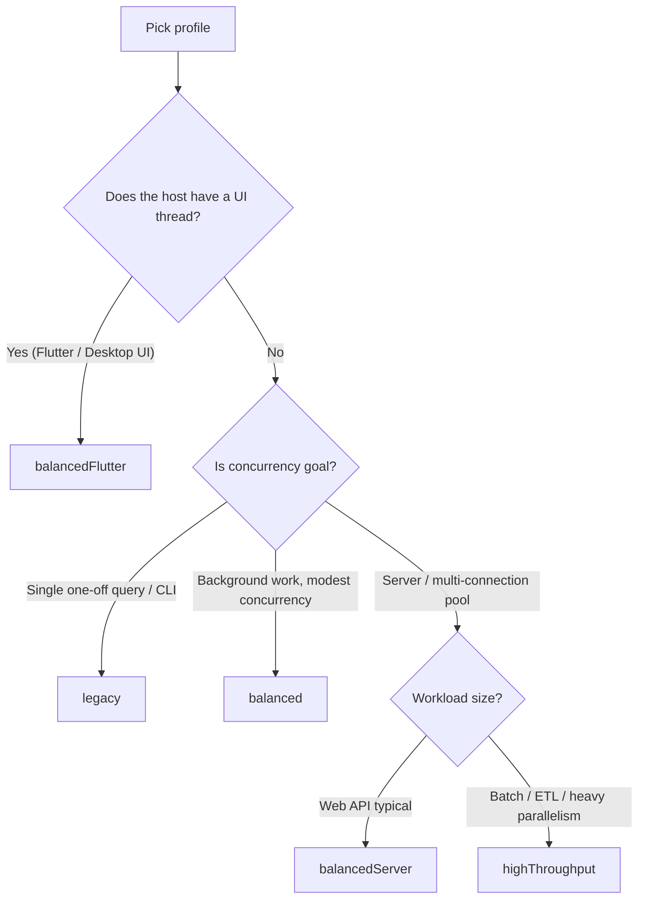

# Profile Selection Guide — `OdbcUsageProfile`

`OdbcUsageProfile` selects sane defaults for `ServiceLocator.initialize` —
async workers, backpressure, recommended pool size, and connection
options. This document tells you **which profile to pick** based on the
shape of your application.

---

## TL;DR cheat sheet

| Application                      | Profile               | Why                          |
| -------------------------------- | --------------------- | ---------------------------- |
| Flutter UI (mobile / desktop)    | `balancedFlutter`     | Single worker keeps the UI thread cool; bounded pending |
| CLI / scripts (one-off SQL)      | `legacy`              | Sync, no isolate overhead, no surprises |
| Embedded background daemon       | `balanced`            | 2 workers, async, generic preset |
| Web service / API backend        | `balancedServer`      | 4 workers, larger pool, native pool friendly |
| Batch / ETL / data pipelines     | `highThroughput`      | 6 workers, big pool, max parallelism |

---

## Decision tree



---

## Resolved defaults

| Profile           | useAsync | workerCount | maxPendingRequests | backpressureMode | recommendedPoolMaxSize |
| ----------------- | -------- | ----------- | ------------------ | ---------------- | ---------------------- |
| `legacy`          | no       | 1           | unbounded          | failFast         | 4                      |
| `balanced`        | yes      | 2           | 24                 | failFast         | 4                      |
| `balancedFlutter` | yes      | 1           | 16                 | waitForSlot      | 4                      |
| `balancedServer`  | yes      | 4           | 32                 | failFast         | 8                      |
| `highThroughput`  | yes      | 6           | 48                 | failFast         | 12                     |

> Source of truth: `lib/domain/entities/odbc_usage_profile_preset.dart`. The
> `ServiceLocator.resolvedUsageProfile` getter returns the actual values
> applied at runtime so the host can log them at startup.

---

## When to override

The defaults are deliberately conservative. Pass explicit overrides to
`ServiceLocator.initialize` when:

- **The host runs on a constrained device**: drop `asyncWorkerCount` to
  1–2 to limit isolate memory.
- **The pool is sized differently from the recommendation**: pass
  `asyncMaxPendingRequests` ≈ `poolSize * 2..4` so backpressure trips
  before the native pool stalls.
- **Backpressure must block instead of fail**: pass
  `asyncBackpressureMode: AsyncBackpressureMode.waitForSlot` plus an
  `asyncBackpressureTimeout`. Useful when callers cannot retry.
- **The CLI tool is long-running**: switch from `legacy` to `balanced`
  to free the calling thread during slow queries.

```dart
final locator = ServiceLocator()
  ..initialize(
    profile: OdbcUsageProfile.balancedServer,
    asyncMaxPendingRequests: 64,        // pool maxSize=16 × 4
    asyncBackpressureMode: AsyncBackpressureMode.waitForSlot,
    asyncBackpressureTimeout: const Duration(seconds: 5),
  );
```

---

## Per-profile notes

### `legacy`

The historical sync mode. Does not spawn worker isolates. Operations
block the calling thread while the FFI call runs. Use it for short
scripts, migrations, or anywhere isolate setup cost is unwanted.

### `balanced`

The recommended general-purpose preset. Two workers handle most
desktop / server background workloads. Pending cap of 24 prevents
runaway burst load from queuing forever. Backpressure is fail-fast so
callers see resource exhaustion immediately and can retry / shed load.

### `balancedFlutter`

One worker is enough because the typical Flutter app holds a single
connection. Backpressure is `waitForSlot` so user-driven actions
(button taps, scroll-driven fetches) queue politely instead of
flooding the user with retry errors. Pending cap is 16.

### `balancedServer`

Four workers fit modern multi-core boxes. Pending cap of 32 matches a
native pool of size 8 with a fan-out factor of 4 — leaves headroom
during traffic spikes without queuing forever. Use when you have:

- A native connection pool of 6–12 connections
- Multiple concurrent HTTP/gRPC handlers
- Mostly query-bound workload

### `highThroughput`

Six workers + pending cap 48 + recommended pool size 12. Designed for:

- Batch ingestion / ETL pipelines
- Bulk insert with `ParallelBulkInsert`
- Multi-database fan-out

Avoid for typical request/response APIs — the extra workers waste
isolate memory and the pending cap is overkill.

---

## How `ServiceLocator` applies the preset

1. `initialize(profile: ...)` resolves the preset via
   `OdbcProfileAsyncDefaults.fromUsageProfile`.
2. Explicit overrides (`useAsync`, `asyncWorkerCount`,
   `asyncMaxPendingRequests`, `asyncBackpressureMode`,
   `asyncBackpressureTimeout`) take precedence over the preset.
3. The effective configuration is exposed via
   `ServiceLocator.resolvedUsageProfile` — log it at startup for
   observability.
4. Recommended companion options for the connection and pool are
   surfaced as `recommendedConnectionOptions` and
   `recommendedPoolOptions`. Pass them to `connect()` /
   `poolCreate()` to avoid re-deriving the same values manually.

---

## Related documentation

- [`async_api_guide.md`](./async_api_guide.md): backpressure, worker
  recovery, request timeout deep-dive.
- [`data_paths.md`](./data_paths.md): bulk insert and streaming
  characteristics relevant to `highThroughput`.
- `example/quick_start_balanced_demo.dart`: minimal end-to-end with
  `balanced`.
- `example/high_concurrency_pool_demo.dart`: `highThroughput` with a
  native pool.
