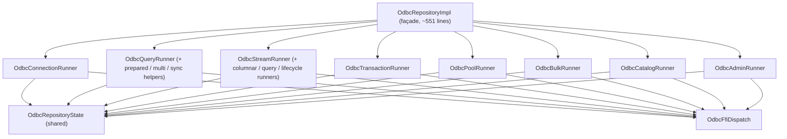

# `OdbcRepositoryImpl` — split plan (archived)

## Status

**Done (2026-06).** The monolithic ~3500-line implementation was refactored
into a thin façade (~551 lines) delegating to capability-focused runners under
`lib/infrastructure/repositories/runners/`. Shared connection/pool/statement
state lives in `OdbcRepositoryState` (`repository_state.dart`).

This document is kept for historical context. Do not reopen the split unless a
new runner category is warranted.

## Final shape

## Constraints (preserved)

1. **Public surface frozen.** `IOdbcRepository` and `OdbcService` API stayed
   intact; the split was internal organization only.
2. **State is shared.** All connection/pool/statement maps live in
   `OdbcRepositoryState` with documented invariants.
3. **Backend pattern matching.** Runners receive `OdbcBackend` via
   `OdbcFfiDispatch`, not inheritance.
4. **Worker-recovery callback.** `OdbcConnectionRunner.onWorkerRecovered`
   clears shared state in one place.

## Runner inventory

| Runner | Responsibility |
| ------ | -------------- |
| `OdbcConnectionRunner` | connect/disconnect, options, capabilities |
| `OdbcQueryRunner` | execute/prepare/catalog/bulk orchestration |
| `OdbcStreamRunner` | `streamQuery*`, columnar batched wire |
| `OdbcTransactionRunner` | local transactions, savepoints, XA / 2PC |
| `OdbcPoolRunner` | native pool lifecycle |
| `OdbcBulkRunner` | bulk insert helpers |
| `OdbcCatalogRunner` | metadata reflection |
| `OdbcAdminRunner` | initialize, audit, metrics, events |

## Original migration sequence (completed)

The incremental PR sequence below was executed during the v4.x refactor cycle:

1. Extract `OdbcRepositoryState`
2. Extract `OdbcCatalogRunner`
3. Extract `OdbcBulkRunner`
4. Extract `OdbcPoolRunner`
5. Extract `OdbcConnectionRunner`
6. Extract `OdbcQueryRunner`
7. Extract `OdbcStreamRunner` (with `StreamQueryRunner`, `StreamColumnarRunner`, …)
8. Extract `OdbcTransactionRunner`
9. Trim `OdbcRepositoryImpl` to façade delegation

## Test strategy (unchanged contract)

- `dart test` remains the regression contract after runner changes.
- `FakeAsyncNativeForRepositoryErrors` exercises runners via the public API.
- Prefer pinning behaviour at the repository boundary, not runner internals.
