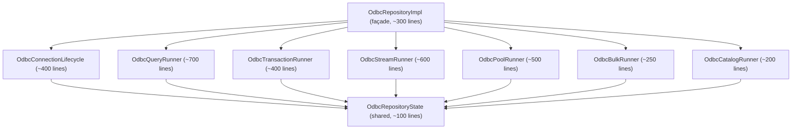

# `OdbcRepositoryImpl` — split plan

## Status

**Future work, scoped.** Phase 3 of the v3.x roadmap landed every other
item on the list; the repository split is the largest remaining piece
and is intentionally deferred to an isolated PR cycle to keep risk low.

## Current shape

`lib/infrastructure/repositories/odbc_repository_impl.dart` is **3517
lines** with ~100 public methods. It implements the entire
`IOdbcRepository` contract by composing:

- Connection lifecycle (`connect`, `disconnect`, options tracking)
- Query execution (`executeQuery*`, `streamQuery*`, prepare/execute)
- Transaction lifecycle (`beginTransaction`, savepoints, XA / 2PC)
- Connection pooling (`poolCreate`, `poolGetConnection`, etc.)
- Bulk insert (parallel / array)
- Catalog / metadata
- Audit + metrics + capabilities probing

It already keeps state local — the only `dynamic` field was eliminated
in Phase 1 (`_backend: OdbcBackend`).

## Target shape

## Constraints

1. **Public surface is frozen.** `IOdbcRepository` and `OdbcService` API
   stay intact. The split is internal organization only.
2. **State is shared.** All seven private maps
   (`_connectionIds`, `_connectionOptions`, `_connectionStrings`,
   `_namedParamOrderByStmtId`, `_statementConnectionByStmtId`,
   `_poolCheckouts`, `_connectionPoolId`) are read or mutated by every
   "runner" category. They must live in a single `OdbcRepositoryState`
   container with documented invariants.
3. **Backend pattern matching.** Every runner needs the same
   `OdbcBackend` reference. Pass it via constructor, not via inheritance.
4. **Worker-recovery callback.** `_onUnderlyingWorkerRecovered` must
   continue to clear all maps in one place — easiest if `State` owns
   the cleanup method and runners just delegate.

## Migration sequence

The split must be incremental. Each step is its own PR with the full
test suite green before the next starts.

1. **Step 1: Extract `OdbcRepositoryState`.**
   - New file: `lib/infrastructure/repositories/_state/repository_state.dart`
     (private to package).
   - Move: the 7 maps, `_clearAllStatementMetadata`,
     `_clearStatementMetadataForConnection`, `_optionsFor`,
     `_validateStatementOwnership`, `dartSideMetrics`.
   - `OdbcRepositoryImpl` holds `final _state = OdbcRepositoryState()`.
2. **Step 2: Extract `OdbcCatalogRunner`.** Smallest surface, mostly
   independent.
3. **Step 3: Extract `OdbcBulkRunner`.** Smallest with state ties.
4. **Step 4: Extract `OdbcPoolRunner`.** Already has the `_runBoolFfi`
   helper as a precedent.
5. **Step 5: Extract `OdbcConnectionLifecycle`.** Touches state heavily;
   covered by the most tests, do it once others are stable.
6. **Step 6: Extract `OdbcQueryRunner`.** Largest body but
   self-contained logic.
7. **Step 7: Extract `OdbcStreamRunner`.** Depends on
   `OdbcQueryRunner._streamNativeQueryWithFallback` — coordinate.
8. **Step 8: Extract `OdbcTransactionRunner` (incl. XA).** Touches
   savepoint dialect resolution; coordinate with engine team for any
   wire changes.
9. **Step 9: Trim `OdbcRepositoryImpl` to a thin façade.** Each method
   delegates to the relevant runner. Final size target: ~300 lines.

## Test strategy

- Run `dart test` after every step. Fast suite (1000+ tests) is the
  regression contract.
- No new fakes. The existing `FakeAsyncNativeForRepositoryErrors`
  exercises every runner via the public API.
- Add at most one new test per step that pins the new runner's
  internal contract (e.g. `OdbcRepositoryState.dartSideMetrics`).

## Why we deferred this in v3.x

- The remaining items on the v3.x roadmap (Fase 3.1 through 3.3) all
  shipped by augmenting public APIs. The repository split is **internal
  reorganization only** — it doesn't unblock any consumer or close a
  bug. The cost-benefit of doing it during the same PR cycle as
  visible features didn't justify the risk.
- The Phase 1 win (`OdbcBackend` sealed class, `_runBoolFfi` helper)
  already removed the worst readability problem without moving any
  code across files.
- Coverage Dart in CI (Phase 1) is now in place, so the next PR cycle
  can quote per-file coverage deltas as the split proceeds.

## When to start

When at least one of these is true:

- A new feature lands that would naturally fit one of the target
  runner classes (e.g. a new audit endpoint → `OdbcCatalogRunner`).
- A bug investigation in `OdbcRepositoryImpl` needs to touch state
  invariants and the existing 3500-line file makes the diff hard to
  review.
- Review feedback on a normal PR explicitly cites the file size as a
  blocker.

Until then, every method added to the repository should follow the
existing `_runBoolFfi` pattern (helpers extracted, error factories
reused) and stay categorized in its mental bucket so the eventual move
is mechanical.
