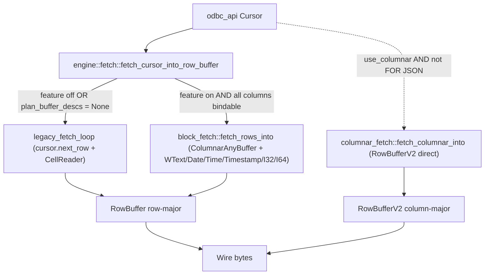
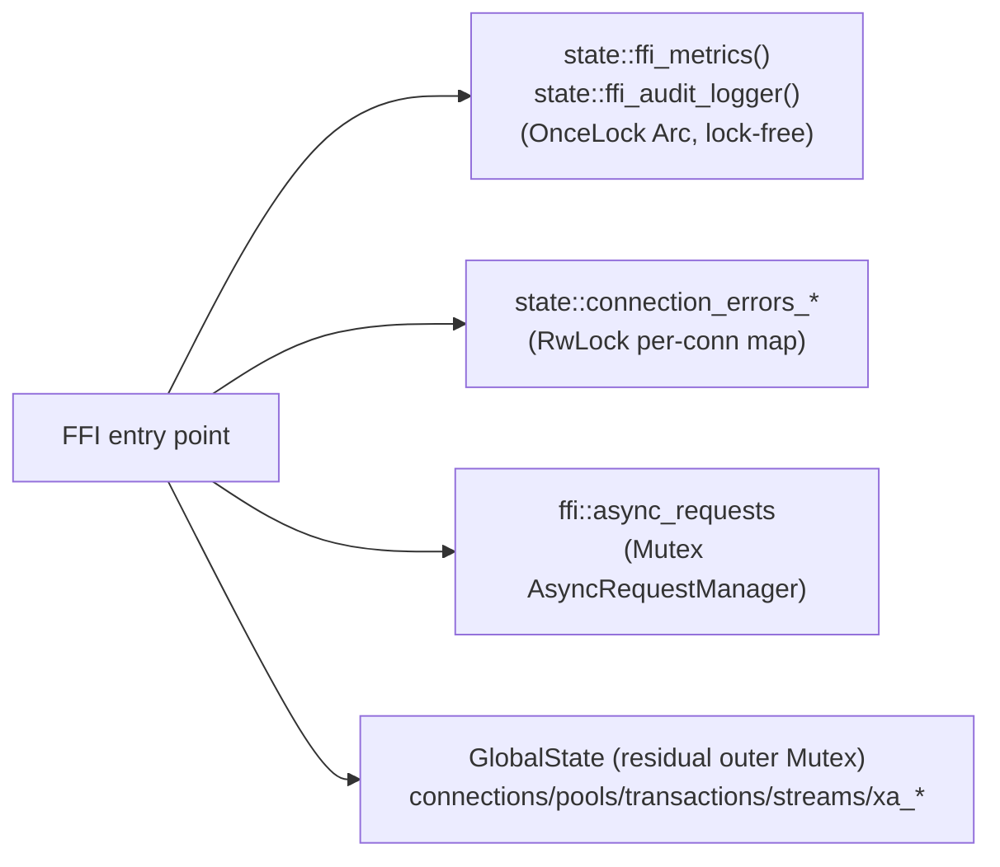
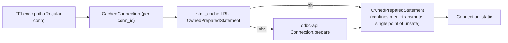

# ODBC Engine – Architecture

## Overview

The ODBC Engine is a Rust library exposing a C-compatible FFI for Dart/Flutter. It follows Clean Architecture with clear layer boundaries and minimal coupling.

## Layers

```
┌─────────────────────────────────────────────────────────┐
│  Presentation (Dart) / FFI boundary                      │
└─────────────────────────────────────────────────────────┘
                            │
┌─────────────────────────────────────────────────────────┐
│  FFI (ffi/mod.rs) – C API, GlobalState, error mapping   │
└─────────────────────────────────────────────────────────┘
                            │
┌─────────────────────────────────────────────────────────┐
│  Engine – connections, queries, streaming, pool usage    │
└─────────────────────────────────────────────────────────┘
                            │
┌─────────────────────────────────────────────────────────┐
│  Protocol – binary encode/decode, compression            │
└─────────────────────────────────────────────────────────┘
                            │
┌─────────────────────────────────────────────────────────┐
│  Infrastructure – handles, pool (r2d2), odbc_api         │
└─────────────────────────────────────────────────────────┘
```

- **FFI**: Owns `GlobalState`, `odbc_*` C exports, and maps Rust `Result` to return codes.
- **Engine**: Connection lifecycle, query execution, streaming, use of pool and protocol.
- **Protocol**: Row/columnar encoding, compression, decoder.
- **Infrastructure**: ODBC handles, r2d2 pool, `odbc_api` usage.

Domain-style types (errors, protocol types) live in `error` and `protocol` and stay free of FFI/IO details.

## Design Decisions

### r2d2 for connection pooling

- **Choice**: r2d2 as the connection pool.
- **Rationale**: Mature, thread-safe, and `ManageConnection` fits ODBC well. Pool size, timeouts, and health checks (`is_valid` / `has_broken`) are configurable.
- **Usage**: One pool per connection string (or per logical “backend”). Pool ID is derived from `server:port:user` (database excluded) for reuse when only database changes.

### Custom binary protocol

- **Choice**: Custom binary encoding (magic, version, column/row layout) instead of raw ODBC result handling over FFI.
- **Rationale**:
  - Single, compact buffer per result set for FFI (no repeated callbacks).
  - Version field allows evolution without breaking clients.
  - Enables optional compression and format changes (e.g. columnar) behind version.
- **Format**: Magic (`0x4F444243`), version, column count, row count, payload size, then metadata and row data. Optional compression for large payloads.

### Plugin system (driver-specific behavior)

- **Choice**: Pluggable driver adapters (e.g. SQL Server, PostgreSQL, Oracle, Sybase) via a small registry.
- **Rationale**: Type mapping, dialect hints, and optimizations (e.g. batching, rewrites) vary by driver. Plugins keep engine core generic while allowing driver-specific logic.
- **Usage**: Registry keyed by driver or connection string; engine uses the selected plugin for mapping and optional rewrites.

### Environment singleton and `OnceLock` (pool)

- **Choice**: A single ODBC `Environment` per process. Pool uses `OnceLock<Environment>` (no `Box::leak`).
- **Rationale**:
  - ODBC allows one `Environment` per process; connections are created from it.
  - `Connection<'static>` in `odbc_api` ties connection lifetime to an env that effectively lives for the process.
  - `OnceLock` gives one-time init, no leak, and clear ownership. Handles may still use `Box::leak` for the same env where required by `odbc_api` signatures; that trade-off is documented.

### Observability and metrics

- **Choice**: Central `Metrics` (query counts, latencies, errors, uptime) and optional integration with logging/tracing.
- **Rationale**: Essential for production debugging and performance. Metrics are updated in the FFI layer (e.g. around `odbc_exec_query`) and exposed via `odbc_get_metrics` for Dart.

## Module map

| Module                | Role                                                                                  |
| --------------------- | ------------------------------------------------------------------------------------- |
| `engine`              | Connections, queries, streaming, execution pipeline                                   |
| `engine::core`        | Pipeline, batch executor, prepared cache, metadata cache, driver capabilities         |
| `engine::core::block_fetch`    | `BlockCursor` + `ColumnarAnyBuffer` row-major fast path (feature `block-cursor-fetch`) |
| `engine::core::columnar_fetch` | Direct column-major fetch into `RowBufferV2` (same feature, skips transpose)          |
| `engine::fetch`       | Cursor → row-buffer dispatcher (legacy `next_row()` vs block-cursor)                  |
| `ffi`                 | C API, residual `GlobalState`, metrics integration                                    |
| `ffi::state`          | Sharded FFI state: lock-free immutables, dedicated `RwLock` for connection errors     |
| `handles`             | ODBC handle management (env, connections, `CachedConnection`)                         |
| `handles::owned_prepared` | RAII wrapper that confines the `mem::transmute` used by the per-connection cache  |
| `pool`                | r2d2 pool, pool ID, health checks                                                     |
| `protocol`            | Encoder, decoder, compression                                                         |
| `error`               | `OdbcError`, `StructuredError`, `Result`, `ErrorCategory`                             |
| `security`            | Secure buffers, zeroization                                                           |
| `plugins`             | Driver registry and adapters                                                          |
| `observability`       | Metrics, logging, tracing                                                             |

## Fetch paths



Notes:

- `block_fetch::plan_buffer_descs` decides whether the bind path is usable per query — LOB columns and `WLONGVARCHAR` without an advertised max length fall back to the legacy per-row path automatically.
- `OdbcType::Date` / `Time` / `Timestamp` use native `BufferDesc::Date` / `Time` / `Timestamp` (sprint 4 follow-up B5) and are formatted to ISO 8601 in our code, skipping the driver-side WCHAR transcoding.
- Batch size honours the `ODBC_FAST_BLOCK_FETCH_BATCH` env var (default 256). See `engine::core::block_fetch::configured_batch_size`.

## FFI state sharding



Lock ordering canon (when more than one is held in the same scope): `Outer` → `AsyncReqs` → `Errors` write side → `Errors` read side. Immutables are lock-free and may be touched at any point. See `native/odbc_engine/src/ffi/state/mod.rs` for the full contract.

## Prepared statement reuse



- `stmt_cache` is declared **before** `conn` in `CachedConnection` so drop glue runs `stmt_cache.drop()` first — the invariant the `OwnedPreparedStatement::from_borrowed` `# Safety` clause relies on. Reordering the fields trips the `from_borrowed_transmute_size_invariant_holds` tripwire test.
- Sprint 4.2 wire-up extended the cache to the parameterised path through `CachedConnection::execute_query_with_params`; the FFI helper `try_cached_legacy_params` decides per-call whether the params are eligible (legacy list, no NULLs).

## Dependencies

- **odbc_api**: ODBC access.
- **r2d2**: Connection pooling.
- **thiserror / anyhow**: Error handling.
- **lru**: Prepared-statement and metadata caches.
- **zeroize**: Secure buffers.
- **zstd / lz4**: Optional compression for large payloads.

## Error Handling

### Connection-Specific Error Isolation

Errors are stored per-connection to prevent race conditions in concurrent scenarios:

- **Per-connection storage**: `GlobalState.connection_errors: HashMap<u32, ConnectionError>` stores errors keyed by connection ID
- **Thread-safe isolation**: Each connection's errors are isolated, preventing one connection's errors from overwriting another's
- **Backward compatibility**: Global error state (`last_error`, `last_structured_error`) is maintained for FFI functions without connection context
- **Stream error attribution**: `stream_connections: HashMap<u32, u32>` maps stream IDs to connection IDs for proper error attribution during streaming operations

### Error Categorization

The `ErrorCategory` enum provides semantic error classification for intelligent error handling:

- **Transient**: Errors that may be retried (e.g., connection timeouts with SQLSTATE '08xxx')
- **Fatal**: Errors that should abort the operation
- **Validation**: Invalid user input that requires fixing before retry
- **ConnectionLost**: Connection-related errors requiring reconnection

Methods available on `OdbcError`:

- `is_retryable()`: Returns true if error is transient and may be retried
- `is_connection_error()`: Returns true if error is connection-related
- `error_category()`: Returns the semantic category for decision-making

### Structured Errors

Structured errors include SQLSTATE, native error code, and message:

- Serialized format: `[sqlstate: 5 bytes][native_code: 4 bytes][msg_len: 4 bytes][message: N bytes]`
- Exposed via `odbc_get_structured_error()` FFI function
- Automatically extracted from ODBC diagnostics when available

## Conventions

- **FFI**: No panics across the C boundary; use return codes and `odbc_get_error` / `odbc_get_structured_error`.
- **Unsafe**: All `unsafe` blocks documented with `# Safety` or `// Safety` and preconditions. The only remaining `mem::transmute` in the lifetime-fabrication path lives in `handles::owned_prepared::OwnedPreparedStatement::from_borrowed`.
- **Locks**: Prefer `try_lock`/`lock().ok()` in FFI and caches; avoid `unwrap()` on mutexes in hot paths. Per-category sub-locks in `ffi::state` follow the canonical order documented above; never acquire them out of order while holding the residual outer mutex.
- **Error handling**: Always use connection-specific error storage when `conn_id` is available; fall back to global error state only for functions without connection context. The dedicated `RwLock` in `ffi::state` logs `log::error!` on poison so silent diagnostic loss is observable.
- **Defaults**: `block-cursor-fetch` and `statement-handle-reuse` ship enabled by default. Consumers can opt out via `default-features = false, features = ["test-helpers", "observability"]` in their `Cargo.toml`.


